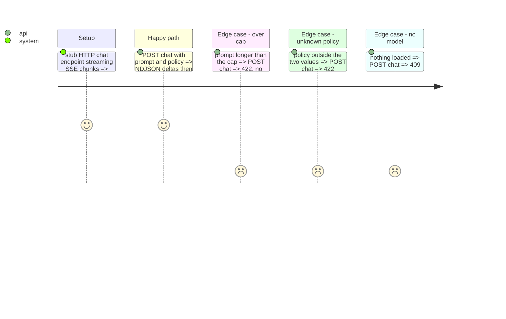

<!-- Fill or omit these sections; never add, rename, or reorder one. -->

# Instruction: Streamed chat proxy

## Architecture projection

```txt
.
├── src/wave_local_ai_v2/playground.py    ✏️ chat body (thinking_kwargs), SSE to NDJSON deltas, caps
├── src/wave_local_ai_v2/service.py       ✏️ POST /api/playground/chat as a StreamingResponse
└── tests/test_playground.py              ✏️ stub llama-server: body shape, policy spelling, over-cap refused, no timings forwarded
```

## Test Scope



## Tasks to do

### `1)` Proxy

1. Validate prompt (non-empty string, within the cap) and policy (`row_contract.THINKING_POLICIES`).
2. Body `{"messages": [user content], "stream": true, "max_tokens": cap, **thinking_kwargs}` to the engine's chat endpoint.
3. Parse `data:` lines; yield `{"delta"}` / `{"reasoning"}`; then `{"final": {thinking_policy, finish_reason}}`; a transport error ends with `{"final": {"error"}}`.

## Test acceptance criteria

| Task | Acceptance criteria |
| ---- | ------------------- |
| 1 | The stub receives the typed text only as message content, the entry's thinking spelling under `disabled` and nothing under `allowed`; no timing value reaches the browser |
