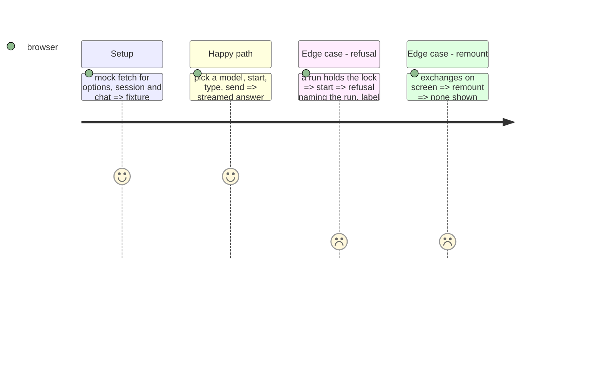

<!-- Fill or omit these sections; never add, rename, or reorder one. -->

# Instruction: Playground screen and its label

## Architecture projection

```txt
.
├── frontend/src/labels/PlaygroundLabel.tsx                ✅ the exact label string
├── frontend/src/labels/PlaygroundLabel.test.tsx           ✅
├── frontend/src/api/client.ts                             ✏️ shared NDJSON reader; playground calls
├── frontend/src/views/playground/PlaygroundPanel.tsx      ✅ model picker, start/stop, prompt, streamed answers, policy beside each
├── frontend/src/views/playground/types.ts                 ✅
├── frontend/src/views/playground/PlaygroundPanel.test.tsx ✅ label on every state, policy beside answers, no speed figure, gone after remount
└── frontend/src/App.tsx                                   ✏️ "Playground →" shown only when the options route answers
```

## Test Scope



## Wireframe

```txt
+--------------------------------------------------------------+
| [playground - nothing here is a benchmark row]               |
| <- Back                                                      |
| Model [qwen3-0.6b-q8 v]  [Start] [Stop]   loaded: <profile>  |
| Thinking [disabled v]                                        |
| +----------------------------------------------------------+ |
| | you: ...                                                 | |
| | model (thinking: disabled): streamed answer...           | |
| +----------------------------------------------------------+ |
| [ type a prompt ....................................] [Send]|
+--------------------------------------------------------------+
```

## Tasks to do

### `1)` Label, client, panel, entry

1. One `PlaygroundLabel` rendered at the top of every panel state.
2. Conversation in component state only.

## Test acceptance criteria

| Task | Acceptance criteria |
| ---- | ------------------- |
| 1 | The label is present in empty, loading, refusal and answered states; no number with a speed unit is rendered; a remount shows no exchange |
