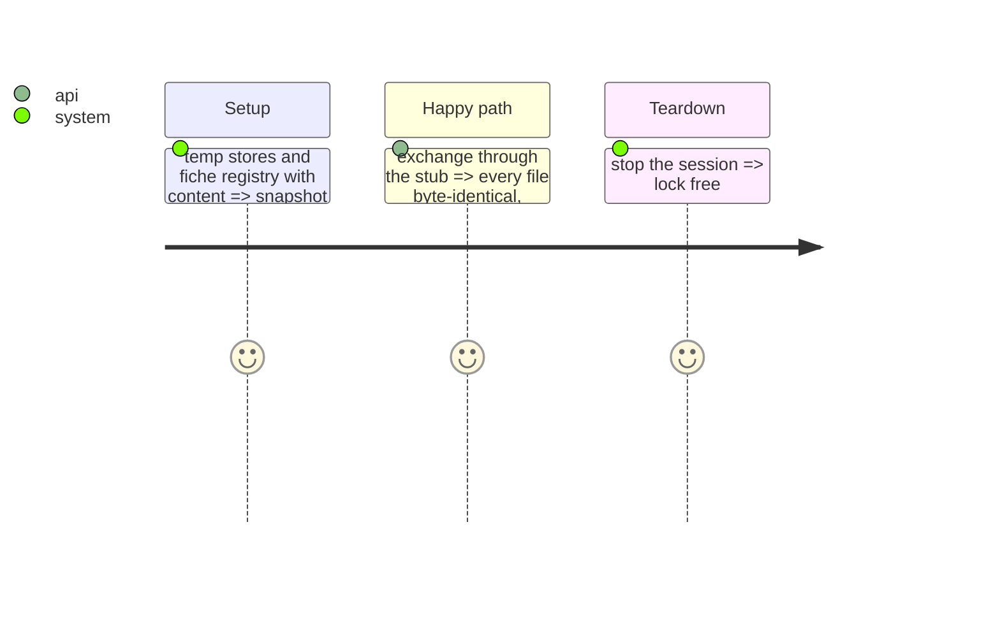

<!-- Fill or omit these sections; never add, rename, or reorder one. -->

# Instruction: No-persistence proof; live check; second-machine evidence

## Architecture projection

```txt
.
├── tests/test_playground.py                                   ✏️ stores, fiche registry and captured logs byte-identical; prompt in none; no writer imported
└── aidd_docs/tasks/2026_10/2026_10_02_local-playground/evidence/ ✅ loopback live check on qwen3-0.6b-q8
```

## Test Scope



## Tasks to do

### `1)` Proof and evidence

1. Structural test: `playground` imports no row writer and opens no file for writing (AST scan, as the console's no-writer test).
2. Live check on loopback with a throwaway cert; service and llama-server stopped by PID.
3. Second-laptop browser-qa videos: pending, operator.

## Test acceptance criteria

| Task | Acceptance criteria |
| ---- | ------------------- |
| 1 | The prompt string is found in no store, registry file or log line after an exchange |
