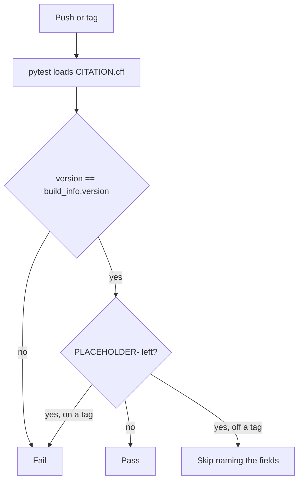
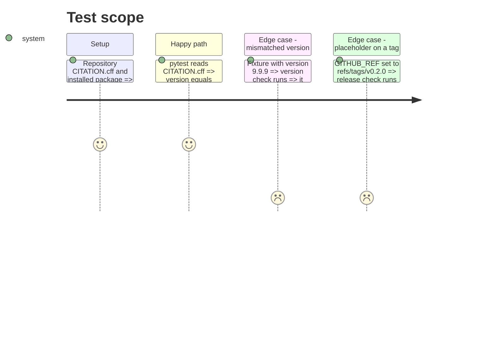

# Instruction: `CITATION.cff` and its version and placeholder checks

## Architecture projection

```txt
.
├── CITATION.cff                  ✅
└── tests/
    └── test_citation.py          ✅
```

## User Journey



## Test Scope



## Tasks to do

### `1)` Write `CITATION.cff`

> A CFF 1.2.0 file naming title, version, placeholder author, repository URL and both licences, with no commit.

1. Keys: `cff-version`, `message`, `type: software`, `title`, `version: 0.2.0`, `date-released` (the `v0.2.0` tag date), `authors` (placeholders), `repository-code`, `license: [MIT, CC-BY-4.0]`.
2. Comments: the commit is stamped into the release archive's copy only; which licence covers which part; which fields await the owner.
3. Validate once with `uvx cffconvert --validate`; save the transcript to `evidence/`.

### `2)` Write `tests/test_citation.py`

> Version agreement, structure, and the placeholder gate.

1. Load with `yaml.safe_load`; version equals `build_info.version()`; a mismatched fixture is reported.
2. Required keys present, licences are exactly MIT and CC-BY-4.0, no `commit` key, the no-commit comment present.
3. Placeholder detector over raw text; fails on a tag ref, skips naming the fields otherwise; fixtures prove both.

## Test acceptance criteria

| Task | Acceptance criteria              |
| ---- | -------------------------------- |
| 1 | `cffconvert --validate` reports the file valid. |
| 2 | The suite passes off a tag, fails on a version mismatch fixture, and fails when `GITHUB_REF` names a tag while a placeholder remains. |
