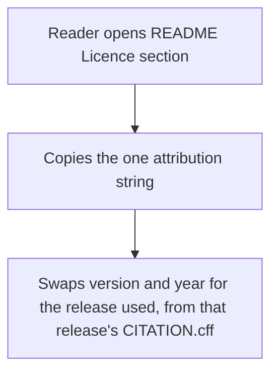
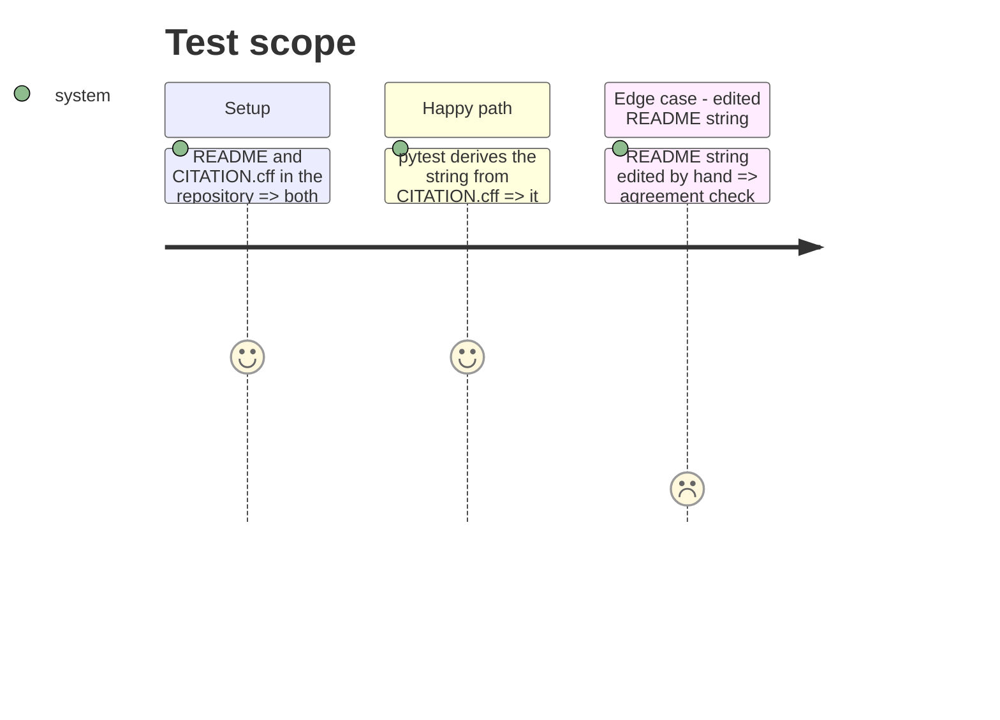

# Instruction: The README attribution string derived from the citation

## Architecture projection

```txt
.
├── LICENSE-DATA                  ✏️
├── README.md                     ✏️
└── tests/
    └── test_citation.py          ✏️
```

## User Journey



## Test Scope



## Tasks to do

### `1)` State the string in the README licence section

> One marked attribution string plus how to cite another release.

1. Replace the "will be stated" paragraph with an `Attribution and citation` subsection holding the string between `attribution:start`/`attribution:end` comments.
2. Explain that the string is derived from `CITATION.cff`, and how to cite another release (its version and year, the archive copy's commit).

### `2)` Derive and check the string

> One derivation function in the test module; the README must equal it.

1. `attribution(citation)` builds the string from authors, `date-released` year, title, version, `repository-code`, licences.
2. Test the README's marked string equals it; a fixture with an edited string fails.

### `3)` Point `LICENSE-DATA` section 4 at the string

> Replace the "will be stated ... Until it is" sentence; keep the Section 3(a) guidance.

## Test acceptance criteria

| Task | Acceptance criteria              |
| ---- | -------------------------------- |
| 1 | The licence section holds exactly one marked attribution string and says how to cite another release. |
| 2 | The agreement test passes on the repository and fails on an edited string. |
| 3 | `LICENSE-DATA` no longer says the string is still to come, and its legal-code hash test still passes. |
