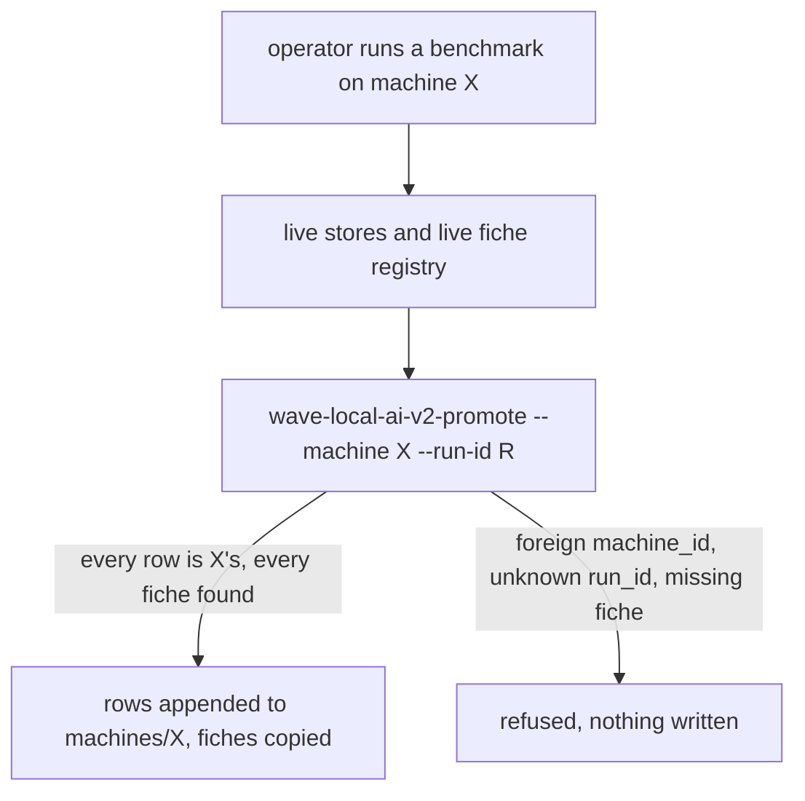
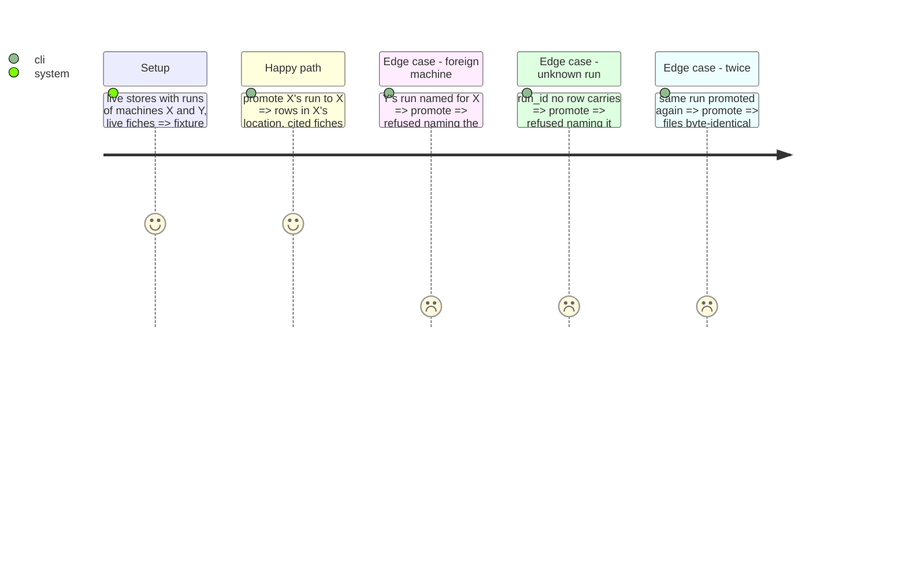

<!-- Fill or omit these sections; never add, rename, or reorder one. -->

# Instruction: Per-machine tracked locations and the promotion command

## Architecture projection

> Tree of the final files. ✅ create · ✏️ modify · ❌ delete

```txt
.
├── src/wave_local_ai_v2/
│   ├── machine_results.py      ✅ location layout, promotion, wave-local-ai-v2-promote
│   ├── settings.py             ✏️ MACHINE_RESULTS_ROOT replaces REFUSALS_DIR; TRACKED_FICHE_REGISTRY_DIR
│   ├── preflight.py            ✏️ refusal_path -> <root>/<machine_id>/refusals.jsonl
│   ├── results.py              ✏️ raw line reading shared by promotion and merge
│   ├── fiche_registry.py       ✏️ copy_fiche (file-for-file, refuses a differing tracked file)
│   └── __init__.py, quality_cli.py, judge_probe.py  ✏️ pass machine_results_root
├── pyproject.toml              ✏️ entry point
├── .env.example                ✏️ MACHINE_RESULTS_ROOT
└── tests/test_machine_results.py ✅ (+ refusals_dir renames in existing tests)
```

## User Journey



## Test Scope



## Tasks to do

### `1)` Location and settings

> One tracked directory per machine; refusals written into it.

1. `MACHINE_RESULTS_ROOT` (default `aidd_docs/results/machines`) replaces `REFUSALS_DIR`; refusal file `<root>/<id>/refusals.jsonl`.
2. `TRACKED_FICHE_REGISTRY_DIR` (default `aidd_docs/results/fiches`).

### `2)` Promotion

> Named runs, all or nothing.

1. Select lines by `run_id` from both live stores; refuse unknown run ids, foreign or missing machine ids, unresolved fiches; then append new lines and copy fiches.
2. CLI `wave-local-ai-v2-promote --machine <id> --run-id <id>...` (machine defaults to `MACHINE_ID`).

## Test acceptance criteria

| Task | Acceptance criteria              |
| ---- | -------------------------------- |
| 1 | A refusal record lands in `machines/<id>/refusals.jsonl` |
| 2 | Promotion lands rows and fiches; refuses a foreign machine and an unknown run naming them; a second promotion changes no byte |
