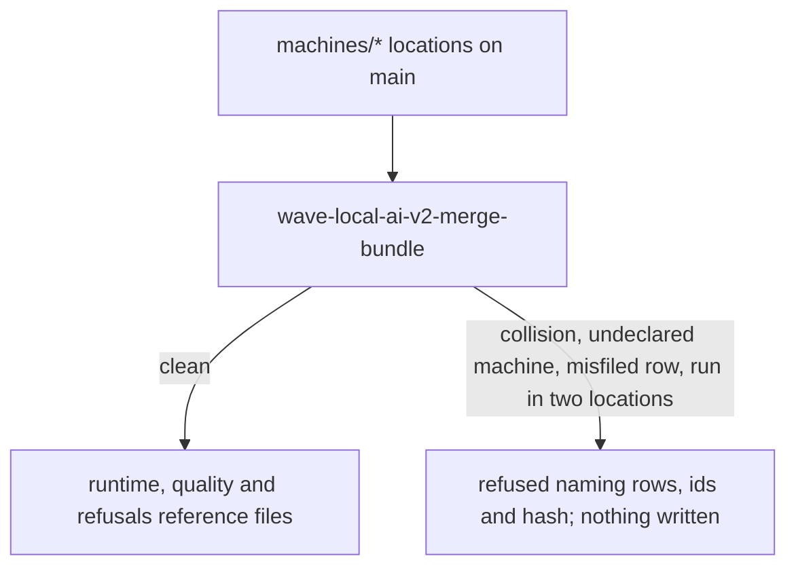
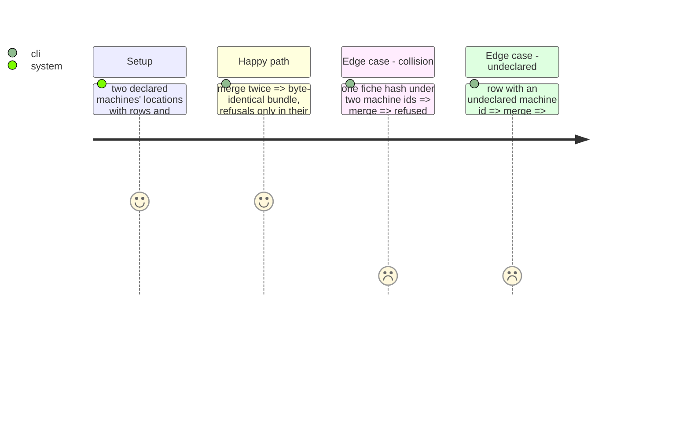

<!-- Fill or omit these sections; never add, rename, or reorder one. -->

# Instruction: The merge command and its refusals

## Architecture projection

> Tree of the final files. ✅ create · ✏️ modify · ❌ delete

```txt
.
├── src/wave_local_ai_v2/bundle_merge.py   ✅ merge, refusals, --check, wave-local-ai-v2-merge-bundle
├── src/wave_local_ai_v2/settings.py       ✏️ DEFAULT_REFUSALS_REFERENCE_PATH
├── pyproject.toml                         ✏️ entry point
└── tests/test_bundle_merge.py             ✅
```

## User Journey



## Test Scope



## Tasks to do

### `1)` Merge

> Derive, never choose.

1. Read every declared machine's location; refuse undeclared location directories, unresolved or misfiled machine ids, one run id in two locations, fiche-hash collisions.
2. Write the three bundle files in sorted machine order, lines unchanged; refuse to overwrite the pinned pre-merge snapshot.

## Test acceptance criteria

| Task | Acceptance criteria              |
| ---- | -------------------------------- |
| 1 | Deterministic bundle; collision and undeclared machine refused by name; refusals only in their own file |
