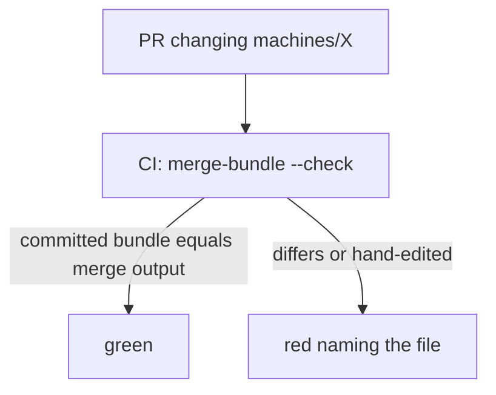
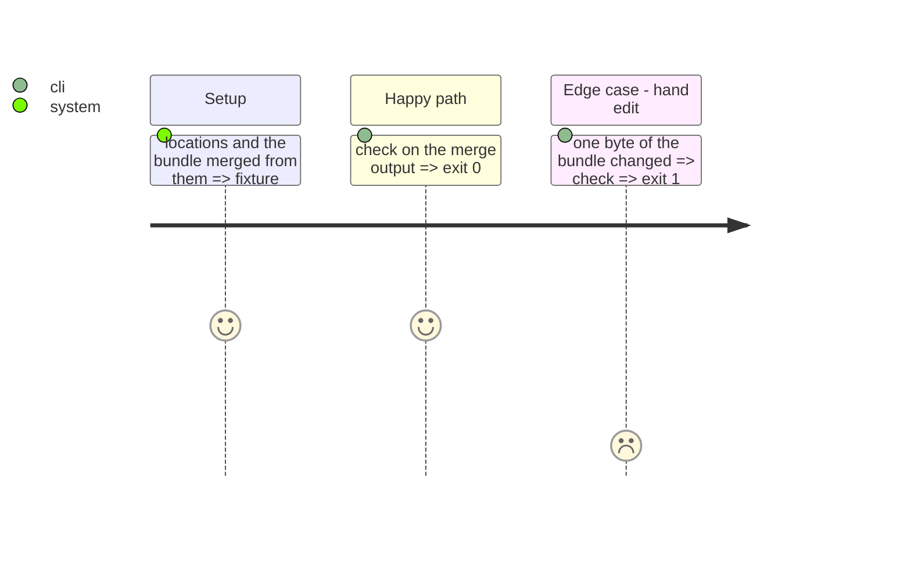

<!-- Fill or omit these sections; never add, rename, or reorder one. -->

# Instruction: The derived-bundle CI check and the bundle-level assertions

## Architecture projection

> Tree of the final files. ✅ create · ✏️ modify · ❌ delete

```txt
.
├── .github/workflows/ci.yml        ✏️ "Derived bundle" step: wave-local-ai-v2-merge-bundle --check
├── tests/test_ci_workflow.py       ✏️ the step exists in the test job
├── tests/test_bundle_merge.py      ✏️ a hand-edited bundle fails --check
└── tests/test_reference_bundle.py  ✏️ three bundle-level assertions
```

## User Journey



## Test Scope



## Tasks to do

### `1)` CI step and its backing tests

> The check CI runs is the one a test proves bites.

1. Add the step after the tests; assert it in `test_ci_workflow.py`.
2. Add the three assertions to `test_reference_bundle.py`, over the committed bundle and over a constructed one.

## Test acceptance criteria

| Task | Acceptance criteria              |
| ---- | -------------------------------- |
| 1 | The check fails a hand-edited bundle; the committed state passes; the three assertions refuse a constructed violation |
