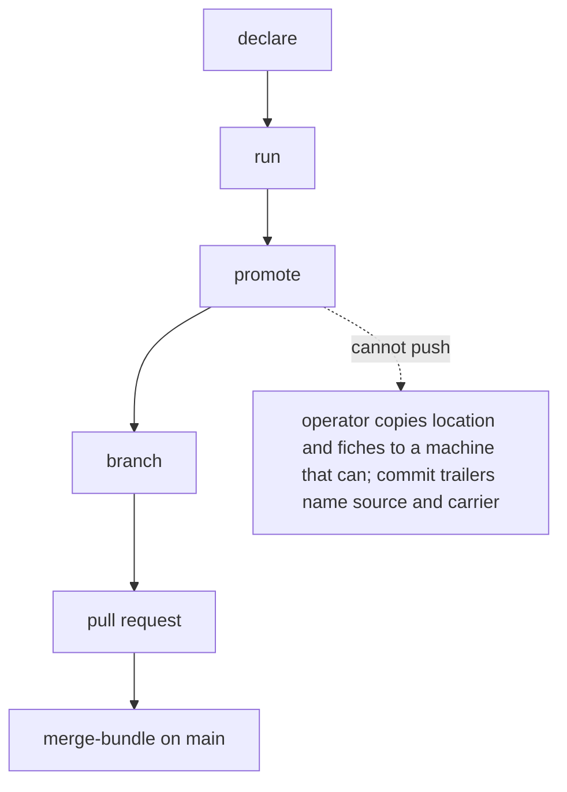

<!-- Fill or omit these sections; never add, rename, or reorder one. -->

# Instruction: Docs, CHANGELOG and the constructed dry run

## Architecture projection

> Tree of the final files. ✅ create · ✏️ modify · ❌ delete

```txt
.
├── docs/setup.md                       ✏️ per-machine loop, operator-carried fallback
├── aidd_docs/results/README.md         ✏️ derived bundle replaces "no CLI ever writes to them"
├── aidd_docs/memory/cli.md             ✏️ the two commands, MACHINE_RESULTS_ROOT
├── aidd_docs/memory/codebase-map.md    ✏️ the two modules and entry points
├── CHANGELOG.md                        ✏️
└── aidd_docs/tasks/2026_10/2026_10_02_rows-by-pull-request/evidence/  ✅ dry run, throwaway-git PR flow
```

## User Journey



## Test Scope

```mermaid
journey
  section Setup
    temp dir with two constructed locations => fixture ready: 5: system
  section Happy path
    merge => bundle written; check => exit 0: 5: cli
  section Edge case - collision
    inject a collision => merge => refusal quoted in evidence: 1: cli
```

## Tasks to do

### `1)` Docs and evidence

> The loop and the fallback, step by step; the refusal quoted.

1. Write the loop and the fallback; README section; CHANGELOG; memory.
2. Run the dry run in a temp dir; save the output in `evidence/`.

## Test acceptance criteria

| Task | Acceptance criteria              |
| ---- | -------------------------------- |
| 1 | Docs name every step; evidence quotes the collision refusal |
