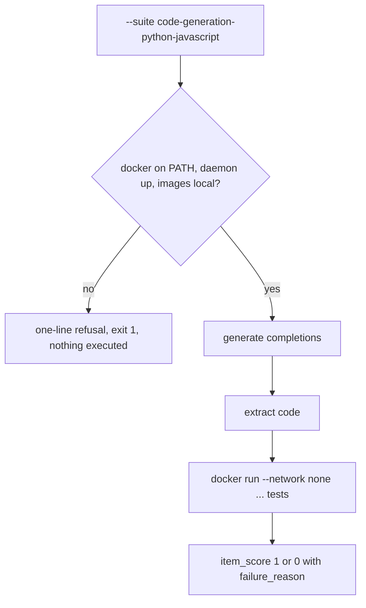
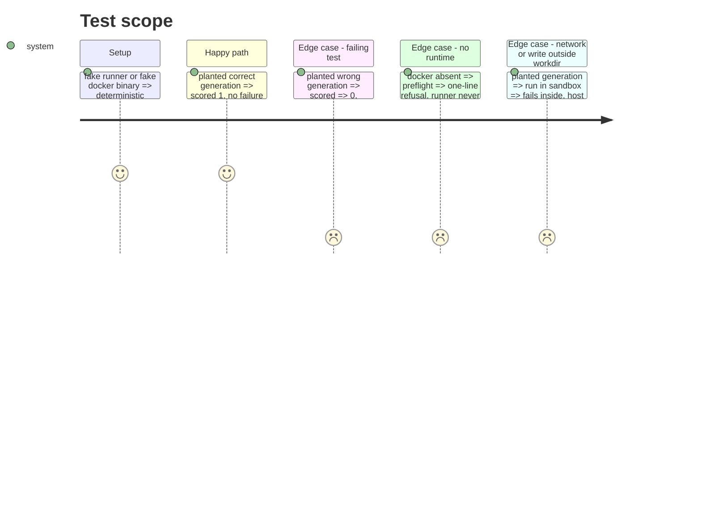

<!-- Fill or omit these sections; never add, rename, or reorder one. -->

# Instruction: Sandbox runner, scoring rule, preflight and refusal

## Architecture projection

```txt
.
├── src/wave_local_ai_v2/
│   ├── code_sandbox.py      ✅ SandboxRunner seam, DockerSandbox, harnesses, availability, refusal
│   ├── code_generation_suite.py ✅ item check, code extraction, per-item and batch scoring
│   ├── scoring_rules.py     ✏️ unit_tests_pass rule + aggregate, PREFLIGHTS, ITEM_CHECKS
│   ├── suite_registry.py    ✏️ run the rule's item check at load, SuiteDefinition.preflight
│   └── quality_cli.py       ✏️ call spec.preflight() after resolve; catch SandboxUnavailable
└── tests/
    ├── test_code_sandbox.py ✅ command shape, refusals, planted outcomes via a fake docker
    └── test_code_generation_suite.py ✅ planted pass/fail/compile/timeout/empty/truncated
```

## User Journey



## Test Scope



## Tasks to do

### `1)` Sandbox seam

1. `SandboxOutcome`, `SandboxRunner` protocol, `DockerSandbox` with caps, harnesses, `check_available`, `SandboxUnavailable`.

### `2)` Scoring rule

1. Extraction, failure taxonomy, per-item fields (graded + code block), aggregate with per-programming-language breakdown.
2. Register rule, aggregate, preflight and item check; registry runs the item check; CLI calls the preflight.

## Test acceptance criteria

| Task | Acceptance criteria              |
| ---- | -------------------------------- |
| 1 | Without docker, the daemon or an image, the preflight refuses in one line and no container is run |
| 1 | The docker command has no mount, `--network none`, `--pull never`, memory and pid caps |
| 2 | A planted passing generation scores 1; a failing, non-compiling, timed-out, empty or truncated one scores 0 with its reason and stays in the denominator |
