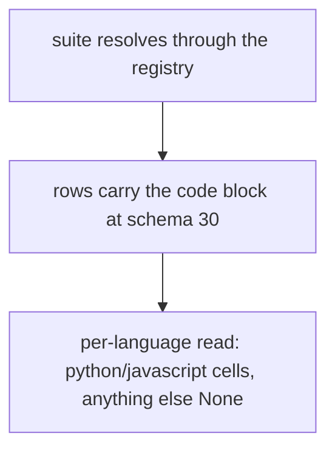
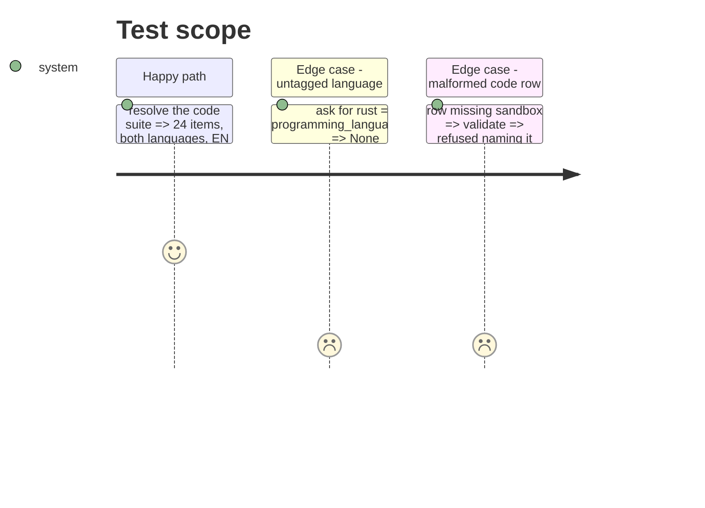

<!-- Fill or omit these sections; never add, rename, or reorder one. -->

# Instruction: Suite data, snapshot, coverage entry, row contract "30", export docs, per-language read

## Architecture projection

```txt
.
├── src/wave_local_ai_v2/
│   ├── suite_data/code-generation-python-javascript.json ✅ 24 items
│   ├── use_case_coverage.json  ✏️ code-generation exercised
│   ├── row_contract.py         ✏️ CODE_FIELDS, schema "30", structure check
│   ├── read_model.py           ✏️ programming_language_score
│   └── bundle_export.py        ✏️ dictionary entries for the code block and new failure keys
├── aidd_docs/results/suite-definitions/code-generation-python-javascript@1.json ✅
└── tests/                      ✏️ registry, coverage, contract, read model, export
```

## User Journey



## Test Scope



## Tasks to do

### `1)` Data and record

1. Suite file, snapshot export, coverage entry.

### `2)` Contract, read, export

1. CODE_FIELDS conditional block, schema "30", per-language read, dictionary entries.

## Test acceptance criteria

| Task | Acceptance criteria              |
| ---- | -------------------------------- |
| 1 | The suite resolves gated, both programming languages present, each natural language >= 25% |
| 2 | A code row validates at "30"; one missing part of the block is refused; an untagged language reads as nothing |
