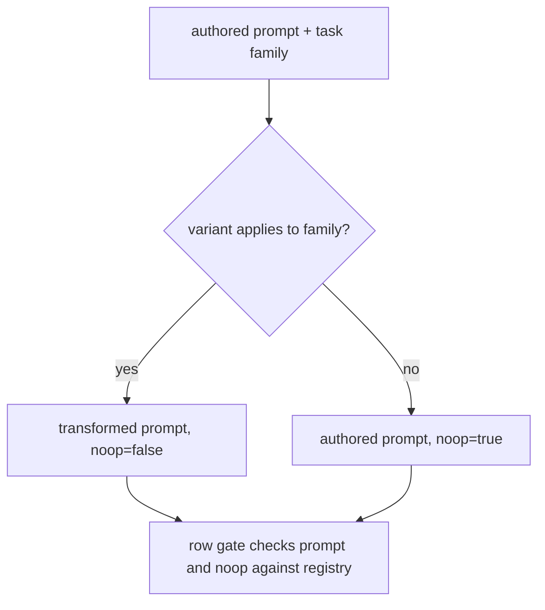
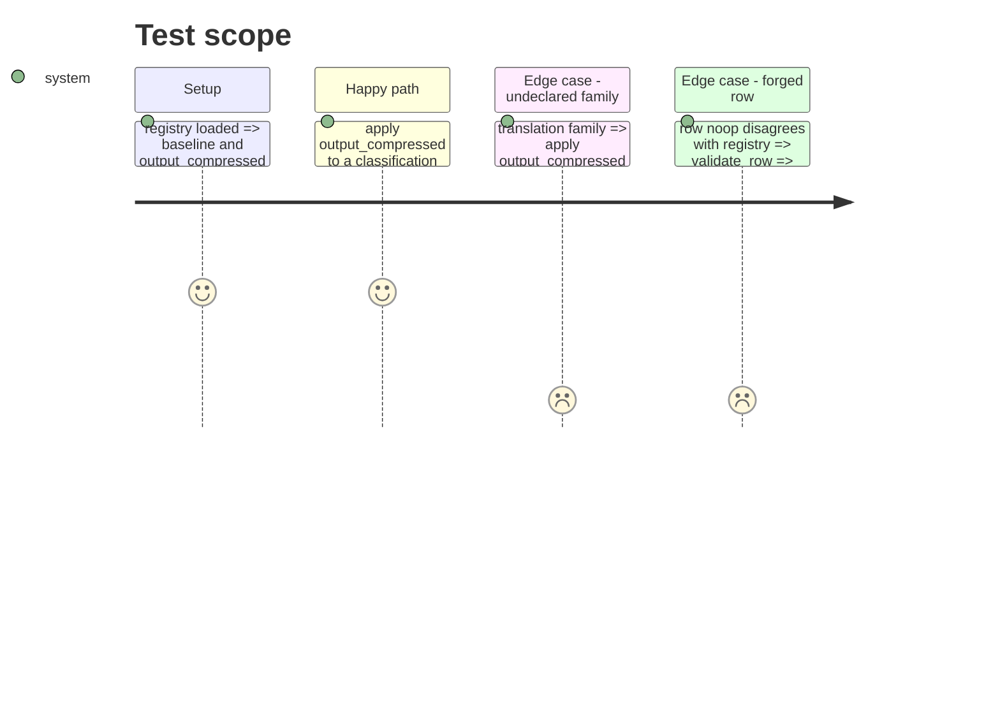

<!-- Fill or omit these sections; never add, rename, or reorder one. -->

# Instruction: Registry entry, applicability and the no-op row field

## Architecture projection

```txt
.
├── src/wave_local_ai_v2/
│   ├── prompt_variants.py   ✏️ output_compressed v1, applies_to, VariantApplication
│   ├── row_contract.py      ✏️ schema "27", prompt_variant_noop, generalized prompt check
│   ├── comparison.py        ✏️ prompt_variant_noop exempt per item
│   ├── bundle_export.py     ✏️ column doc for prompt_variant_noop
│   ├── quality_cli.py       ✏️ rows carry prompt_variant_noop
│   ├── judge_probe.py       ✏️ rows carry prompt_variant_noop
│   └── __init__.py          ✏️ apply_variant call with no family
└── tests/
    ├── test_prompt_variants.py ✏️
    └── test_row_contract.py    ✏️
```

## User Journey



## Test Scope



## Tasks to do

### `1)` Registry entry

1. Add `TRANSFORMATION_APPEND_INSTRUCTION`, `OUTPUT_COMPRESSED_ID`, the entry with `instruction`, `applies_to`, `applicability_reason`, `description`, and its hash.
2. `applies(variant, task_family)`; `apply_variant(variant, prompt, task_family) -> VariantApplication`; load-time check of `applies_to` shape.

### `2)` Row field

1. `SCHEMA_VERSION = "27"`, `VARIANT_NOOP_SCHEMA_VERSION`, quality field required from "27".
2. Gate: bool, equals registry answer; prompt equals the variant applied to the authored text when resolvable.
3. Writers (quality CLI, judge probe, runtime call) pass the family and write the field; comparison exempt; export column doc.

## Test acceptance criteria

| Task | Acceptance criteria |
| ---- | ------------------- |
| 1 | `output_compressed` v1 resolves; an edited definition fails the import check; a translation item gets its authored text back with `noop=True` |
| 2 | A schema "27" quality row without the field, or with a value disagreeing with the registry, or with a prompt the variant would not produce, is refused; a "26" row still validates |
