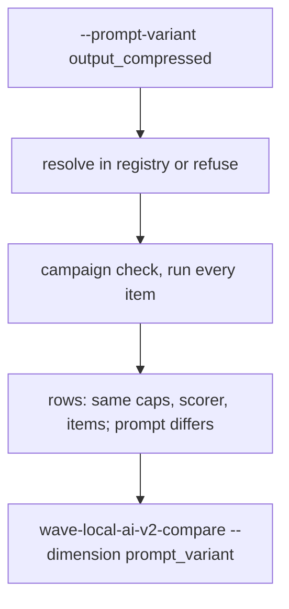
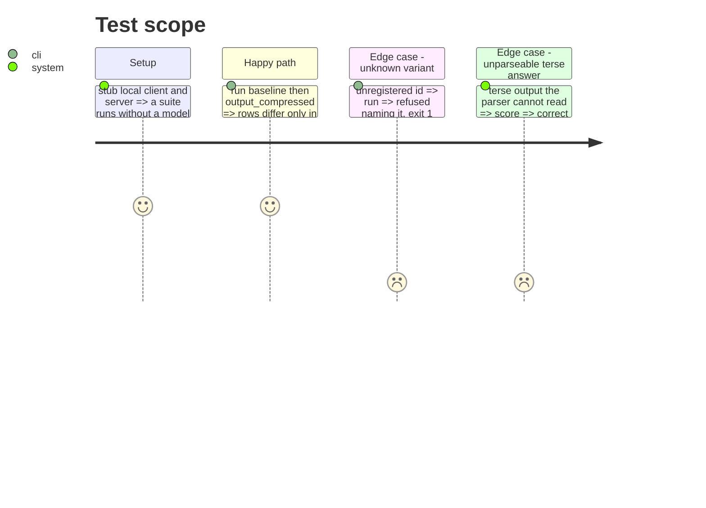

<!-- Fill or omit these sections; never add, rename, or reorder one. -->

# Instruction: `--prompt-variant` on the quality CLI and the story's tests

## Architecture projection

```txt
.
├── src/wave_local_ai_v2/
│   └── quality_cli.py        ✏️ --prompt-variant ID[@VERSION]
└── tests/
    ├── test_quality_cli.py   ✏️ flag, invariance across variants, no-op rows keep items
    ├── test_scoring_rules.py ✏️ unparseable terse answer scores 0 and stays counted
    └── test_comparison.py    ✏️ constructed pair differs only on the variant fields
```

## User Journey



## Test Scope



## Tasks to do

### `1)` Flag

1. Parse `--prompt-variant` (`ID` or `ID@VERSION`), resolve through the registry before settings; unknown refused through `main`'s error tuple.

### `2)` Tests

1. Invariance over every registered suite: every row field outside the prompt/variant/per-item outcome set is equal across the two variants, and item ids are equal.
2. Unparseable terse output scores 0 with its reason and stays in the denominator.
3. Constructed pair through `comparison`: differing fields exactly `{prompt_variant_id, prompt_variant_version}`, no observation.

## Test acceptance criteria

| Task | Acceptance criteria |
| ---- | ------------------- |
| 1 | `--prompt-variant output_compressed` writes rows naming it; an unregistered id exits 1 before any process |
| 2 | The three story tests pass under `uv run pytest` |
