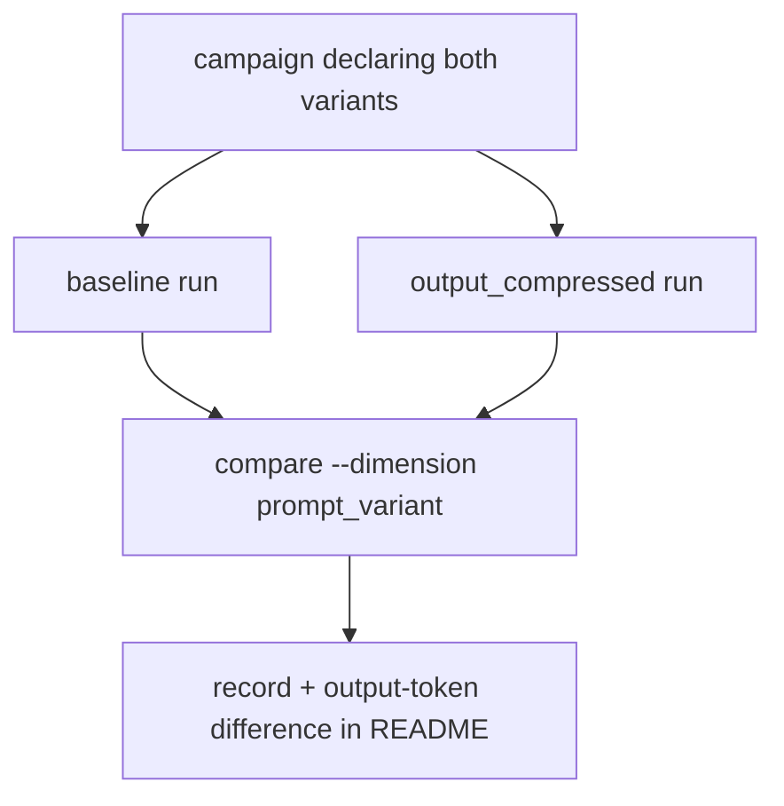
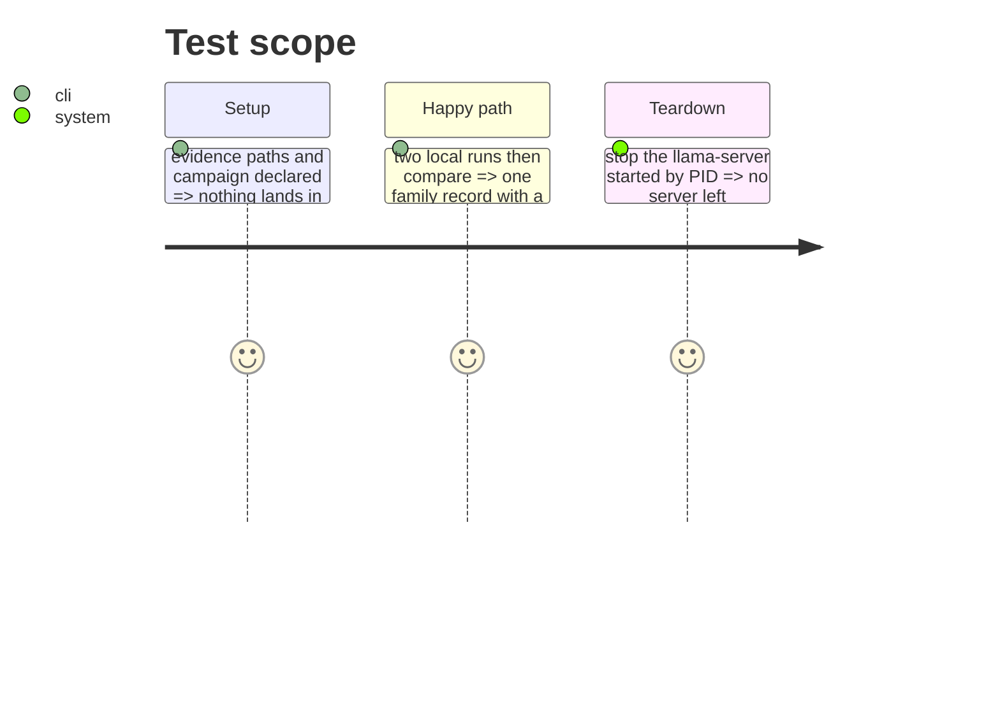

<!-- Fill or omit these sections; never add, rename, or reorder one. -->

# Instruction: Docs and the laptop cell pair

## Architecture projection

```txt
.
├── aidd_docs/memory/cli.md               ✏️ --prompt-variant
├── aidd_docs/memory/architecture.md      ✏️ schema "27" line if listed
├── CHANGELOG.md                          ✏️
├── aidd_docs/results/README.md           ✏️ the pair, its comparison and the token difference
└── aidd_docs/tasks/2026_10/2026_10_02_terse-output-variant/evidence/ ✅ campaign, rows, record, logs
```

## User Journey



## Test Scope



## Tasks to do

### `1)` Run

1. Declare the campaign in `evidence/campaigns/`; run classification under `baseline` and `output_compressed` with `QUALITY_PROVIDERS=local`.
2. `wave-local-ai-v2-compare --dimension prompt_variant --rows evidence/quality.jsonl --records-dir evidence/comparisons`.

### `2)` Docs

1. Record the pair, verdict, p and mean output tokens per arm in `aidd_docs/results/README.md`; CLI and CHANGELOG lines.

## Test acceptance criteria

| Task | Acceptance criteria |
| ---- | ------------------- |
| 1 | Both runs write every classification item; the record's differing fields are the two variant fields |
| 2 | README names the record path, the verdict as published, and the output-token difference |
