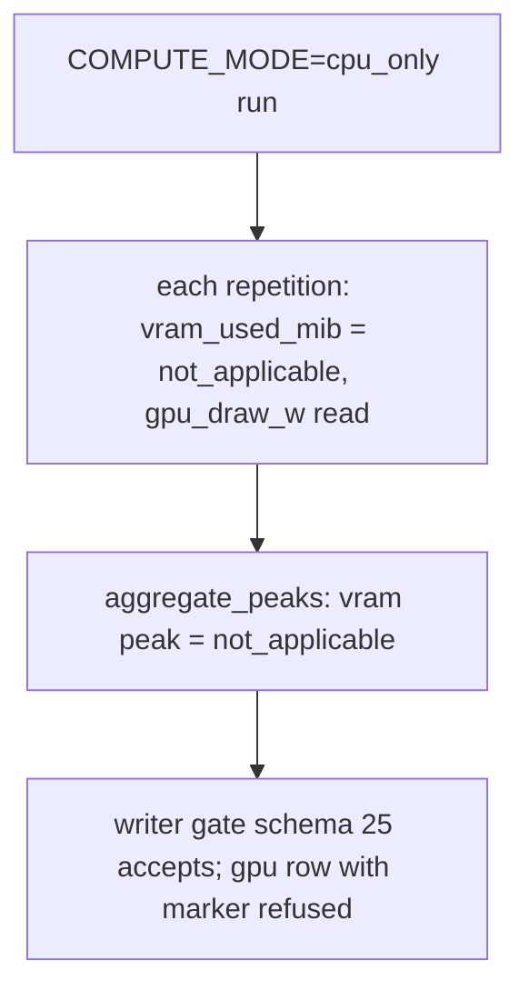
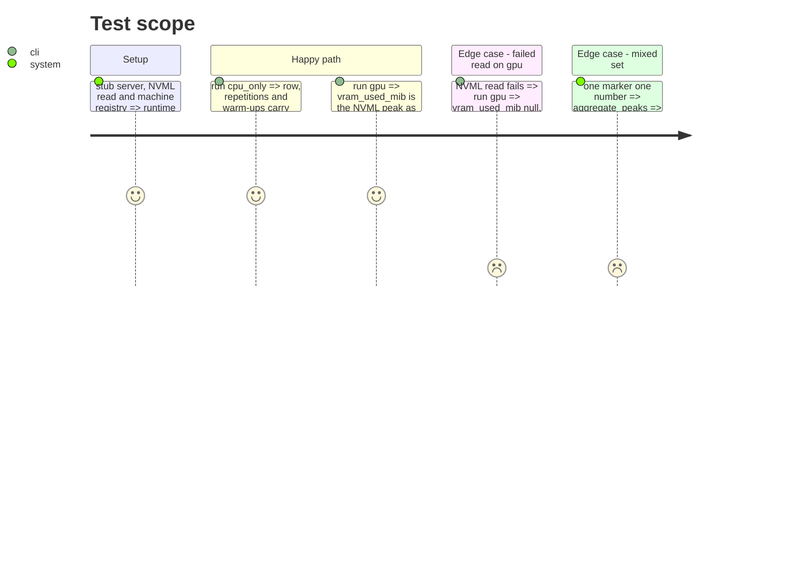

<!-- Fill or omit these sections; never add, rename, or reorder one. -->

# Instruction: Row-level VRAM not-applicable across repetitions, aggregate and contract

## Architecture projection

```txt
.
├── src/wave_local_ai_v2/
│   ├── gpu.py              ✏️ VRAM_NOT_APPLICABLE marker
│   ├── repetitions.py      ✏️ vram_applies switch; marker on every repetition
│   ├── aggregation.py      ✏️ aggregate_peaks (marker peaks to marker, mix refused)
│   ├── __init__.py         ✏️ cpu_only => vram_applies=False; aggregate_peaks
│   ├── row_contract.py     ✏️ schema "25"; cpu_only/gpu VRAM check
│   └── bundle_export.py    ✏️ vram_used_mib meaning names the marker
└── tests/
    ├── test_repetitions.py ✏️
    ├── test_aggregation.py ✏️
    ├── test_row_contract.py ✏️
    └── test_cli.py         ✏️
```

## User Journey



## Test Scope



## Tasks to do

### `1)` Marker and repetition switch

1. `gpu.VRAM_NOT_APPLICABLE = "not_applicable"`.
2. `run_repetition_set(..., vram_applies: bool = True)`; `_run_one` writes the marker when false.

### `2)` Peak aggregate

1. `aggregation.aggregate_peaks(counted)`; `__init__` uses it and passes `vram_applies`.

### `3)` Contract

1. Schema "25"; `_validate_vram_applicability` on runtime rows from "25".
2. Export field meaning names the marker.

## Test acceptance criteria

| Task | Acceptance criteria |
| ---- | ------------------- |
| 1 | A cpu_only repetition carries `vram_used_mib == "not_applicable"`; a gpu one carries the read value or null |
| 2 | Marker-only peaks to marker; a mix raises; numbers peak as before |
| 3 | cpu_only row with a VRAM number (zero included) refused; gpu row with the marker refused; rows below "25" untouched |
