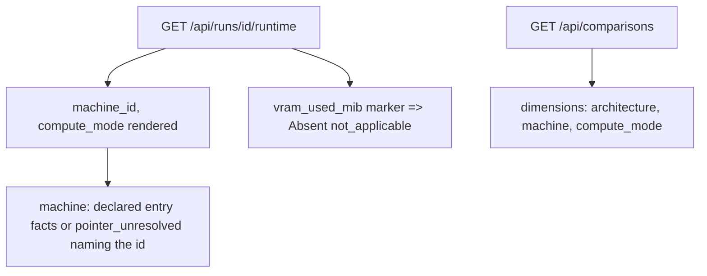
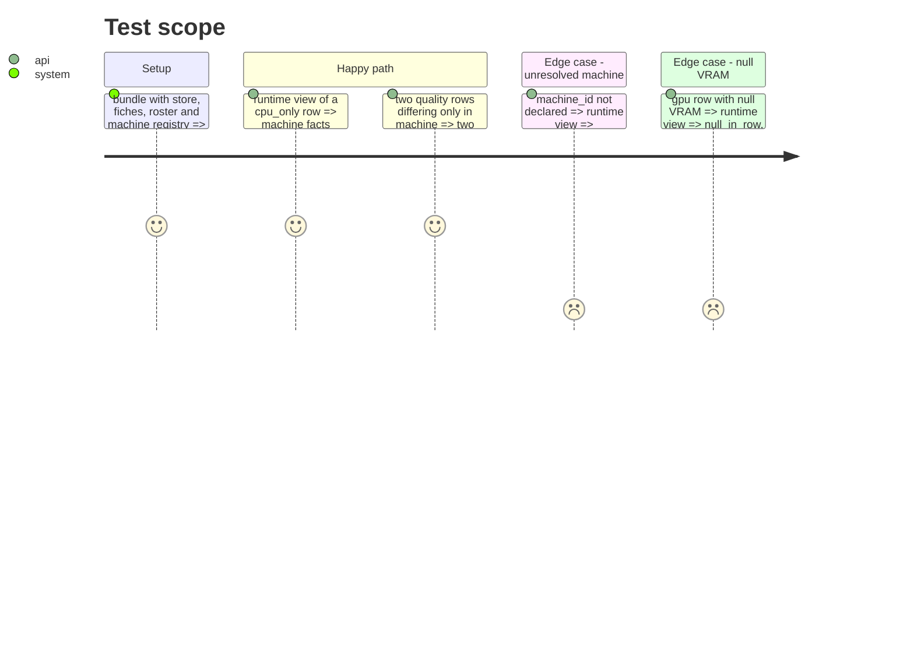

<!-- Fill or omit these sections; never add, rename, or reorder one. -->

# Instruction: Read model: machine pointer, comparison dimensions, absence reason

## Architecture projection

```txt
.
├── src/wave_local_ai_v2/
│   ├── read_model.py  ✏️ ABSENT_NOT_APPLICABLE; resolve_machine_entry; runtime fields; COMPARISON_DIMENSIONS
│   ├── service.py     ✏️ passes the machine registry to the runtime view
│   └── settings.py    ✏️ ServiceSettings.machine_registry_path (default tracked)
└── tests/
    ├── store_fixtures.py   ✏️ declared machine_id/compute_mode; registry in the bundle
    ├── test_read_model.py  ✏️
    ├── test_reference_bundle.py ✏️ runtime_view call
    └── test_service.py     ✏️ if needed
```

## User Journey



## Test Scope



## Tasks to do

### `1)` Absence reason

1. `ABSENT_NOT_APPLICABLE` in `ABSENCE_REASONS`; `resolve_field` maps the VRAM marker to it.

### `2)` Machine pointer

1. `POINTER_MACHINE_ID`, `load_machine_registry`, `resolve_machine_entry`; `runtime_view` takes the registry and returns `machine`.
2. `machine_id`/`compute_mode` move to `RUNTIME_VIEW_FIELDS`.
3. Service settings path and wiring.

### `3)` Comparison dimensions

1. `COMPARISON_DIMENSIONS = ("architecture", "machine", "compute_mode")`; `machine` resolves from `machine_id`.

## Test acceptance criteria

| Task | Acceptance criteria |
| ---- | ------------------- |
| 1 | cpu_only VRAM reads `not_applicable`; a null VRAM still reads `null_in_row` |
| 2 | Declared id resolves with sources; unknown id is `pointer_unresolved` naming `machine_id`; partition tests hold |
| 3 | Two rows differing only in machine open two columns, each naming its machine and mode |
