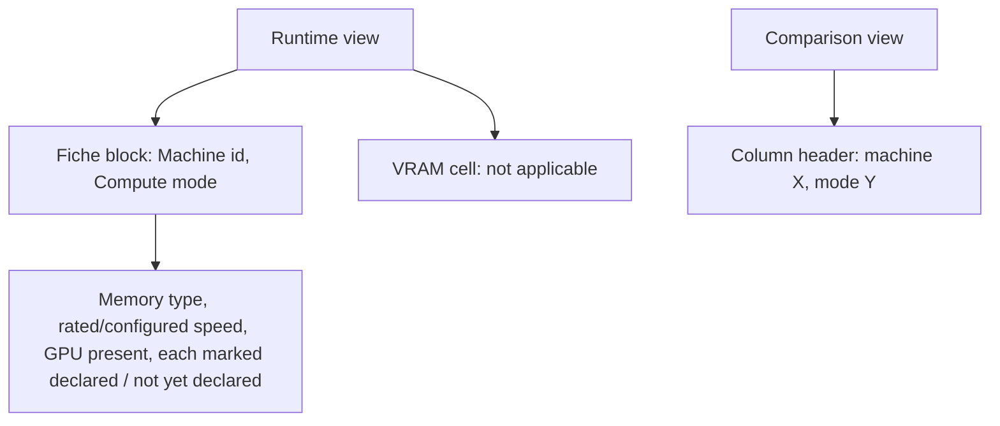
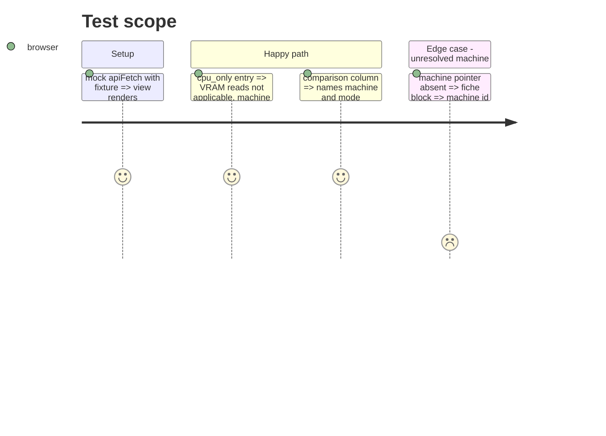

<!-- Fill or omit these sections; never add, rename, or reorder one. -->

# Instruction: Front end: runtime and comparison views

## Architecture projection

```txt
.
└── frontend/src/
    ├── api/types.ts                     ✏️ MachineEntry shape
    ├── components/Absent.tsx            ✏️ not_applicable renders "not applicable"
    ├── components/Absent.test.tsx       ✏️
    ├── views/runtime/RuntimeView.tsx    ✏️ fiche block: machine, mode, declared facts
    ├── views/runtime/types.ts           ✏️
    ├── views/runtime/fixtures/runtimeView.fixture.ts ✏️
    ├── views/runtime/RuntimeView.test.tsx ✏️
    ├── views/comparison/ComparisonView.tsx ✏️ machine / mode dimension prose
    ├── views/comparison/fixtures/comparisonView.fixture.ts ✏️
    └── views/comparison/ComparisonView.test.tsx ✏️
```

## User Journey



## Test Scope



## Wireframe

```txt
┌ Fiche ──────────────────────────────┐
│ Machine        laptop-mobile-gpu (1)│
│ Compute mode   cpu_only          (2)│
│ Memory         DDR4 (declared)   (3)│
│ Memory speed   3200 / 3200 MT/s  (3)│
│ GPU present    yes (declared)    (3)│
│ CPU / RAM / GPU / ... fiche_hash (4)│
└─────────────────────────────────────┘
```

1. Machine id, always visible, even when unresolved.
2. Compute mode from the row.
3. Declared facts with their source label, or the unresolved marker.
4. The existing fiche fields.

## Tasks to do

### `1)` Absent label

1. `not_applicable` renders "not applicable", never "not reported".

### `2)` Runtime view

1. Types, fixture with a cpu_only entry, fiche block machine section.

### `3)` Comparison view

1. `describeDimension` names `machine` and `compute_mode`; fixture carries both dimensions.

## Test acceptance criteria

| Task | Acceptance criteria |
| ---- | ------------------- |
| 1 | "not applicable" text distinct from "not reported" |
| 2 | Machine id, mode, memory type marked declared rendered; unresolved machine named |
| 3 | A column header names its machine and mode |
