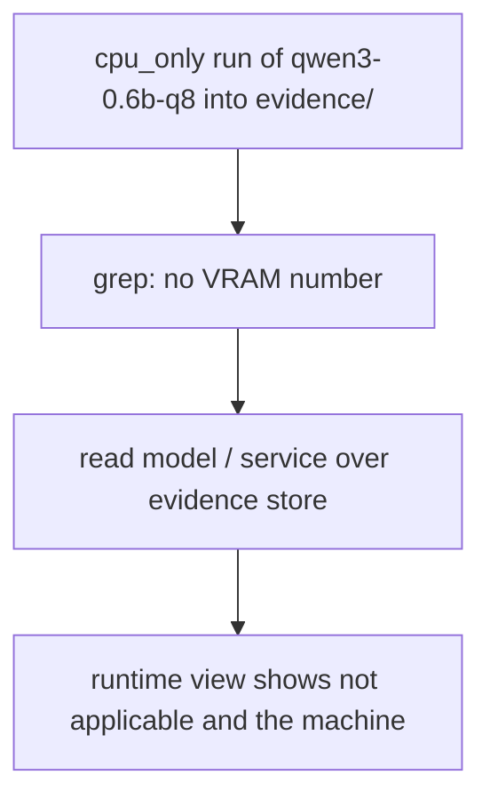
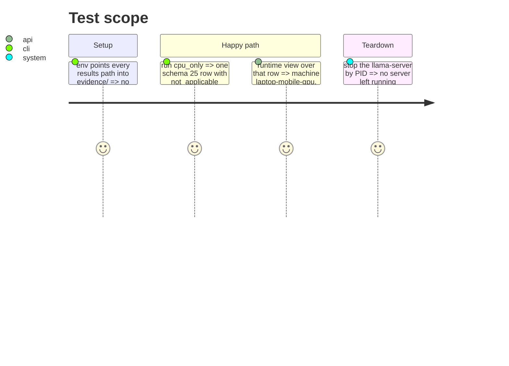

<!-- Fill or omit these sections; never add, rename, or reorder one. -->

# Instruction: Live cpu_only row viewed in the dashboard; CHANGELOG and memory

## Architecture projection

```txt
.
├── CHANGELOG.md                       ✏️ Unreleased entry
├── aidd_docs/memory/architecture.md   ✏️ four absence reasons; VRAM marker
├── aidd_docs/memory/cli.md            ✏️ four absence reasons
└── aidd_docs/tasks/2026_10/2026_10_02_views-name-machine-and-mode/evidence/ ✅ live row, logs, view JSON, screenshots if possible
```

## User Journey



## Test Scope



## Tasks to do

### `1)` Live row

1. Run `wave-local-ai-v2` with `MACHINE_ID=laptop-mobile-gpu COMPUTE_MODE=cpu_only ROSTER_ENTRY_ID=qwen3-0.6b-q8`, results into `evidence/`.
2. Save the run log, the row, a grep proving no VRAM number, and the runtime view JSON.
3. Screenshots when a browser path is available; otherwise report pending.

### `2)` Docs

1. CHANGELOG Unreleased; memory files name the fourth absence reason and the marker.

## Test acceptance criteria

| Task | Acceptance criteria |
| ---- | ------------------- |
| 1 | The live row carries `not_applicable` in all VRAM places and validates |
| 2 | CHANGELOG and memory state the change |
