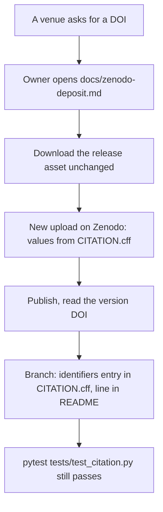
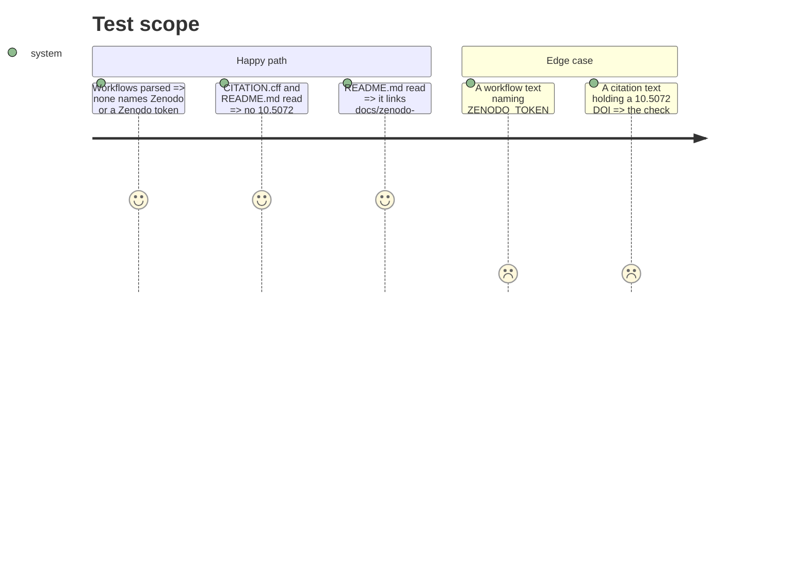

# Instruction: The procedure, its README link and its guard test

## Architecture projection

```txt
.
├── README.md                              ✅ (link + DOI rule pointer)
├── docs/
│   └── zenodo-deposit.md                  ✅ (new)
└── tests/
    └── test_zenodo_deposit_procedure.py   ✅ (new)
```

## User Journey



## Test Scope



## Tasks to do

### `1)` Write `docs/zenodo-deposit.md`

> What to upload, every metadata value and its `CITATION.cff` source, the licence and the mixed-terms description, recording the DOI back, why nothing is automated, the sandbox proving walk and its corrections log, the deposit log.

### `2)` Link it from `README.md`

> One line in "Download the results (no clone)" and one in "Attribution and citation" naming where a DOI goes once one exists.

### `3)` Add `tests/test_zenodo_deposit_procedure.py`

> No workflow names Zenodo; no sandbox DOI in `CITATION.cff` or `README.md`; the README links the procedure; each helper reports a constructed violation.

## Validation

- `uv run pytest`, `uv run pre-commit run --all-files`, the secrets scan on the changed files, `scripts/audit_dependencies.py`, and both `wave-local-ai-v2-validate` runs, from the worktree root.
- Pending (owner): the sandbox walk and the corrections it causes, logged in the procedure's "Proving walk" section.
