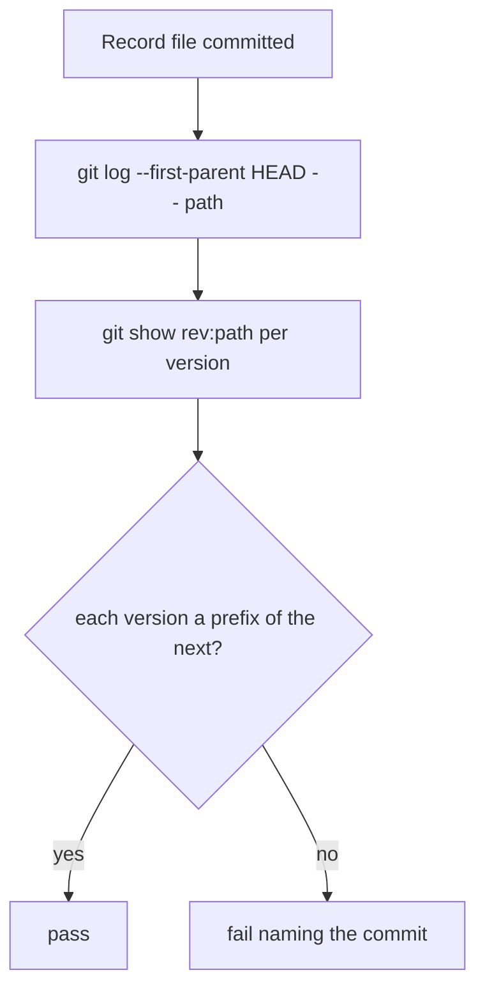

# Instruction: The record file, its tracking and the append-only history test

## Architecture projection

```txt
.
├── .gitignore                                   ✏️ one negation for client-sessions.jsonl
├── .github/workflows/ci.yml                     ✏️ test job checkout fetch-depth: 0
├── aidd_docs/results/client-sessions.jsonl      ✅ empty
├── src/wave_local_ai_v2/client_sessions.py      ✅ append_only_violations, ShallowHistory
└── tests/test_client_sessions.py                ✅ tracked-file and append-only tests
```

## User Journey



## Test Scope

```mermaid
---
title: Test scope
---
journey
  section Setup
    build a throwaway git repository => commits on demand: 5: system
  section Happy path
    two commits that only append => walk reports nothing: 5: system
  section Edge case - edited line
    second version edits line 1 => walk => violation naming the commit: 1: system
  section Edge case - merge
    two branches each append, merged => walk along first parent => nothing: 1: system
  section Edge case - shallow
    shallow clone with CI set => walk => violation; without CI => skip: 1: system
```

## Tasks to do

### `1)` Track the file

1. Add `!aidd_docs/results/client-sessions.jsonl` to `.gitignore`; create the empty file.
2. Test: `git check-ignore --no-index` exits 1 for the path.

### `2)` Append-only walk

1. `append_only_violations(repo, path, *, ci)` walks the first-parent versions, reading blobs.
2. Shallow repo: raise `ShallowHistory` without `ci`, return a violation with it.
3. Set `fetch-depth: 0` on the `test` job checkout.

## Test acceptance criteria

| Task | Acceptance criteria |
| ---- | ------------------- |
| 1 | The record path is not matched by any ignore rule, checked with `--no-index`. |
| 2 | An edit fails, an append passes, a first-parent merge of appends passes, a shallow clone with `CI` fails; the repo's own history passes. |
