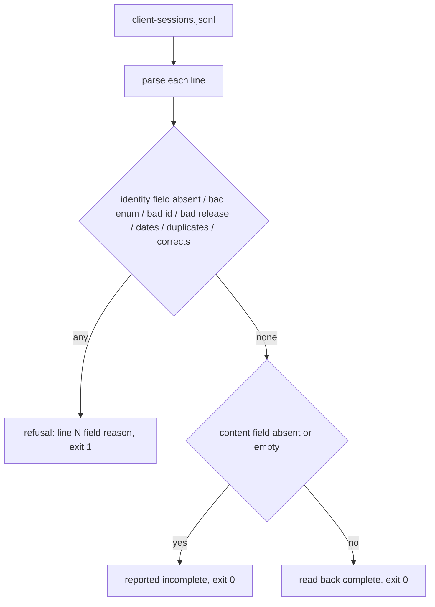
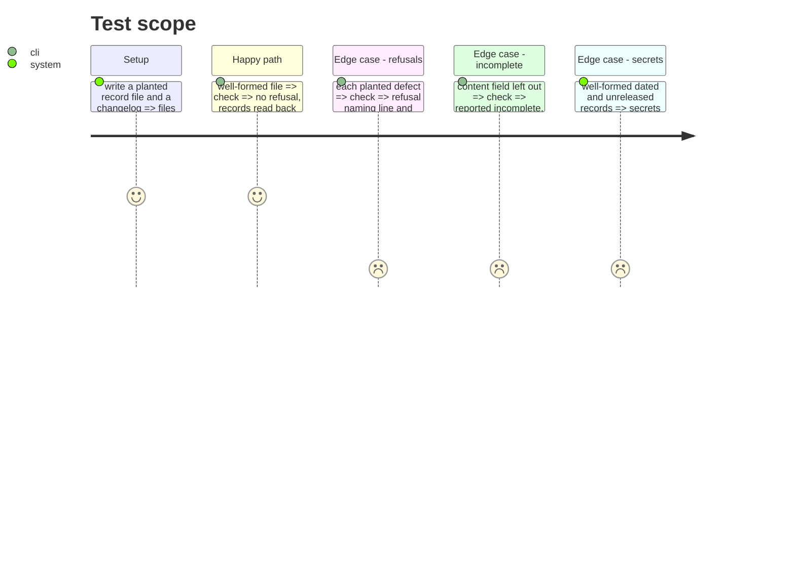

# Instruction: The record format, its check, its refusals and its command

## Architecture projection

```txt
.
├── pyproject.toml                               ✏️ wave-local-ai-v2-client-sessions script
├── src/wave_local_ai_v2/client_sessions.py      ✏️ format, check_records, render, main
└── tests/test_client_sessions.py                ✏️ one planted file per refusal
```

## User Journey



## Test Scope



## Tasks to do

### `1)` Format and check

1. Field tables (required, content, optional, enums, id patterns).
2. `check_records(text, changelog_text, commit_exists)` returns records, refusals, incomplete.
3. Refusals: unparsable line, absent required field, enum outside set, wrong type, unknown key, id pattern, duplicate session id, `corrects` naming no earlier record or a second correction, release neither dated heading nor unreleased with existing commit, session before release date, logged before session, outcome/challenge mismatch, empty claims.

### `2)` Command

1. `main(argv)`: `--sessions`, `--changelog`; renders records, incomplete, refusals; exit 0/1/2.
2. `[project.scripts]` entry.

### `3)` Committed-record and secrets tests

1. The committed file passes; a planted malformed committed file fails.
2. Secrets scan over well-formed dated and unreleased records finds nothing; positive control flagged.

## Test acceptance criteria

| Task | Acceptance criteria |
| ---- | ------------------- |
| 1 | Every refusal in the story names line and field; incomplete records stay in the file and are reported, not refused. |
| 2 | The command exits 0 on the empty file, 1 on a refusal, 2 on an unreadable file. |
| 3 | The shipped empty file passes; scan of well-formed records finds nothing. |
