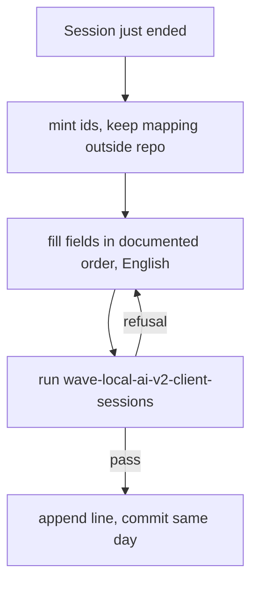
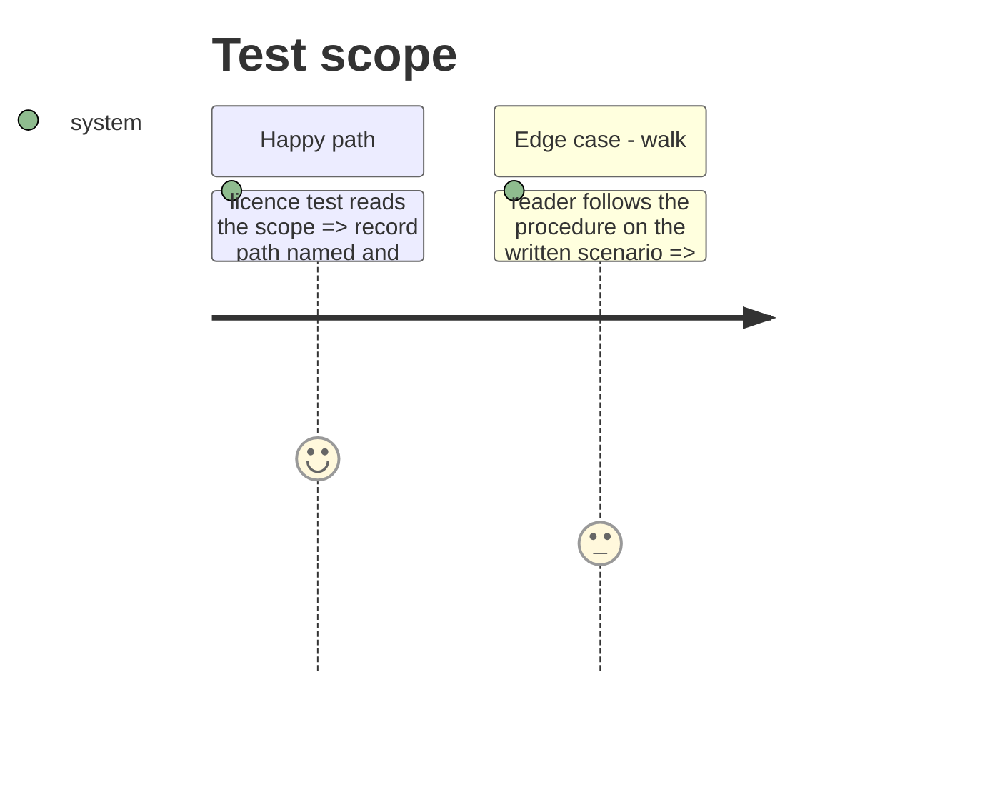

# Instruction: The procedure, the walk scenario and the licence scope

## Architecture projection

```txt
.
├── docs/client-session-record.md                ✅ the same-day procedure, worked example inside
├── aidd_docs/results/README.md                  ✏️ link to the procedure
├── aidd_docs/results/NOTICE.md                  ✏️ names the record
├── LICENSE-DATA                                 ✏️ covered entry for the record
├── tests/test_data_licence.py                   ✏️ required path
├── aidd_docs/memory/cli.md                      ✏️ the new command
├── aidd_docs/memory/codebase-map.md             ✏️ module and entry point
└── aidd_docs/tasks/2026_10/2026_10_04_client-showing-record/evidence/walk-scenario.md ✅
```

## User Journey



## Test Scope



## Tasks to do

### `1)` Procedure

1. Steps: ids and mapping, fields in key order, claims follow criterion, English, no client names or material, backfill rule, run the check, append-only and corrections, worked example.
2. Link from the results README.

### `2)` Licence scope and memory

1. LICENSE-DATA covered entry, NOTICE.md line, test required path.
2. cli.md and codebase-map.md entries.

### `3)` Walk scenario

1. A written scenario a separate session can follow without committing.

## Test acceptance criteria

| Task | Acceptance criteria |
| ---- | ------------------- |
| 1 | The procedure is reachable from the results README and its worked example passes the check. |
| 2 | The licence test requires the record path and passes. |
| 3 | The scenario names every fact the record needs and says to commit nothing. |
