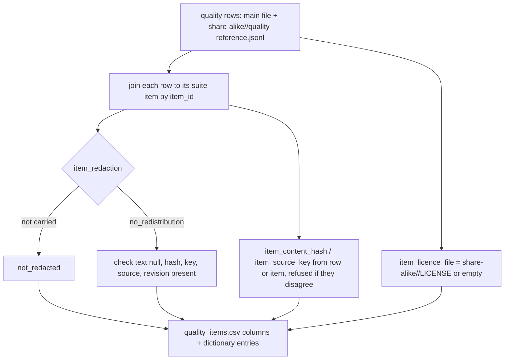

# Instruction: The export reads each item's terms, the share-alike area and the redacted shape

## Architecture projection

> Tree of the final files. ✅ create · ✏️ modify · ❌ delete

```txt
.
├── src/wave_local_ai_v2/
│   ├── settings.py              ✏️ DEFAULT_SHARE_ALIKE_DIR
│   └── bundle_export.py         ✏️ item-terms source and fields, share-alike reading, redaction and provenance checks, drawn_sources()
├── tests/test_bundle_export.py  ✏️ constructed rungs, hand-written hash reason, provenance values
└── aidd_docs/memory/cli.md      ✏️ the export's new columns and --share-alike-dir
```

## User Journey



## Test Scope

```mermaid
---
title: Test scope
---
journey
  section Setup
    construct bundles from committed rows, one per rung => tiny bundles on disk: 5: system
  section Happy path
    export a permissive bundle => drawn rows show licence, source, revision, hash; hand-written rows CC-BY-4.0 and an empty hash with its named reason: 5: system
    export a share-alike bundle => its rows carry item_licence_file share-alike/<id>/LICENSE: 5: system
    export a no-redistribution bundle => redacted rows carry no_redistribution, hash, source, revision, key and empty text cells: 5: system
    read the dictionary => provenance names every value the rows carry: 5: system
  section Edge case - misfiled or malformed
    a redacted row still holding its prompt, a row and item disagreeing on the hash, a share-alike set without LICENSE => export refused by name: 1: system
```

## Tasks to do

### `1)` Item-terms columns

> Four columns read, never decided, by the export.

1. `ITEM_TERMS_FIELDS` registry (content_hash, source_key, redaction, licence_file) with meaning, unit, empty reason.
2. Index each suite definition's items by `item_id`; refuse a row citing an item its definition lacks.
3. Exclude the row's `item_content_hash`, `item_source_key`, `item_redaction` from the row source; a fifth quality source supplies the four columns.

### `2)` Share-alike area

> `BundlePaths.share_alike_dir`, default `aidd_docs/results/share-alike`.

1. Each `<id>/` needs `LICENSE`, `quality-reference.jsonl`, `suite-definitions/`; rows appended after the main ones, each mapped to its LICENSE path.
2. Refuse: a set row whose `item_licence` is not `<id>`; a main row under a share-alike licence; one suite pair in both places.
3. Manifest rows per set; `--share-alike-dir` on the command.

### `3)` Redaction and provenance checks

1. Redacted row: text fields carried are null; hash, key, source, revision present. Unknown `item_redaction` value refused.
2. Redacted snapshot item (`redaction: no_redistribution`): allow-list of keys, required keys present (`redacted_item_problem`, reused by the archive).
3. `provenance` entry names `hand_written` and `public`; another value is refused.
4. Item text fields' empty-cell reasons name redaction.
5. `drawn_sources(bundle)`: each drawn source, licence, revision, rung from the layout, licence file, stable key and content fields; a source with mixed redaction refused.

## Test acceptance criteria

| Task | Acceptance criteria |
| ---- | ------------------- |
| 1 | A drawn row exports its licence, source, revision and content hash; a hand-written row exports CC-BY-4.0 and an empty hash cell whose dictionary reason names prompt_set_hash |
| 2 | A share-alike row's `item_licence_file` is its set's LICENSE path; every other row's cell is empty with a named reason |
| 3 | A redacted row exports `no_redistribution`, hash, source, revision and key; every misfiled or malformed case is refused by name |
