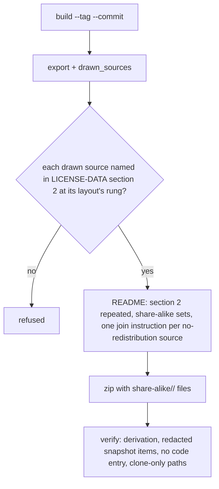
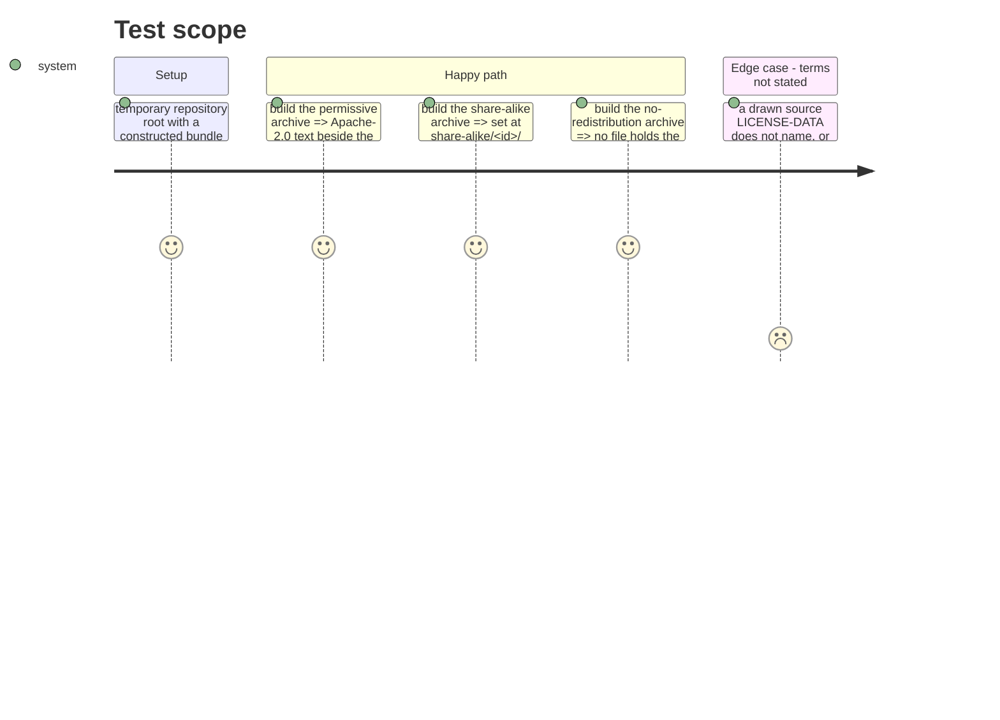

# Instruction: LICENSE-DATA's rung rules and the archive that carries them

## Architecture projection

> Tree of the final files. ✅ create · ✏️ modify · ❌ delete

```txt
.
├── LICENSE-DATA                             ✏️ section 2: what each rung does, the content-hash recipe
├── scripts/assemble_release_archive.py      ✏️ share-alike files, drawn-items README section, rung and code gates
├── tests/test_assemble_release_archive.py   ✏️ constructed bundle per rung, built and verified
├── tests/test_data_licence.py               ✏️ section 2 names the rungs and the recipe
└── aidd_docs/tasks/2026_10/2026_10_04_drawn-item-download/evidence/  ✅ local build, README section, redacted row
```

## User Journey



## Test Scope



## Tasks to do

### `1)` LICENSE-DATA section 2

1. State what each rung does (permissive, share-alike layout and `item_licence_file`, no-redistribution redaction and join by hand, no fetch script) and the content-hash recipe.
2. Test the section names the three rungs and the recipe.

### `2)` The archive

1. `bundle_files` ships each share-alike set; README describes them.
2. README: section 2 repeated verbatim; share-alike sets; one join instruction per no-redistribution source; generic licences paragraph.
3. Gates: drawn source named at its rung; redacted snapshot items shaped; no code entry. Section 2's clone-only paths named by README too.

### `3)` Evidence

1. Build the real archive into a temp dir; save listing, verify line, drawn-items section, drawn rows' new cells; save one constructed redacted row as exported.

## Test acceptance criteria

| Task | Acceptance criteria |
| ---- | ------------------- |
| 1 | Section 2 lists each source with its licence, rung and notices, and states every rung's consequence and the recipe |
| 2 | Each rung's constructed archive builds and verifies with the files, columns and README text the story names; the refusals fire |
| 3 | The real archive builds and verifies with section 2 repeated in its README |
