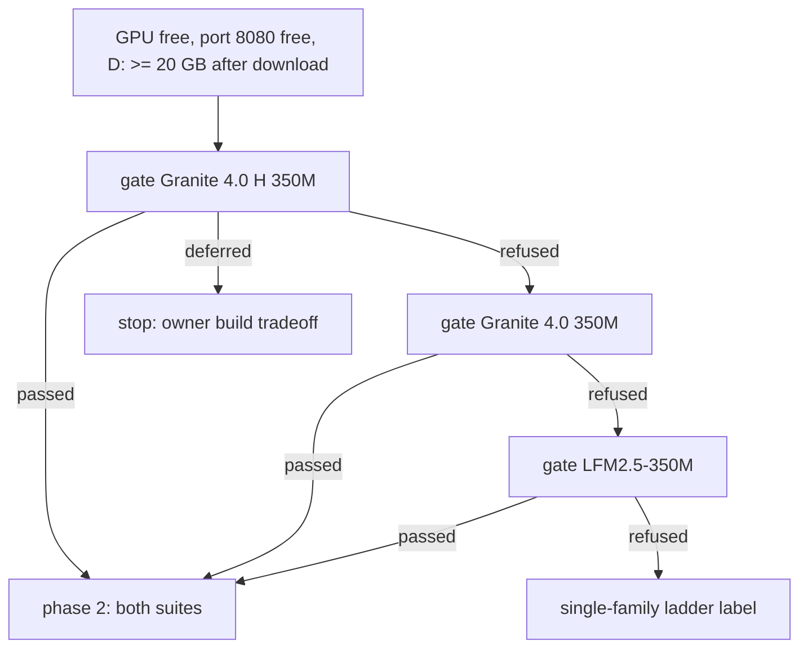
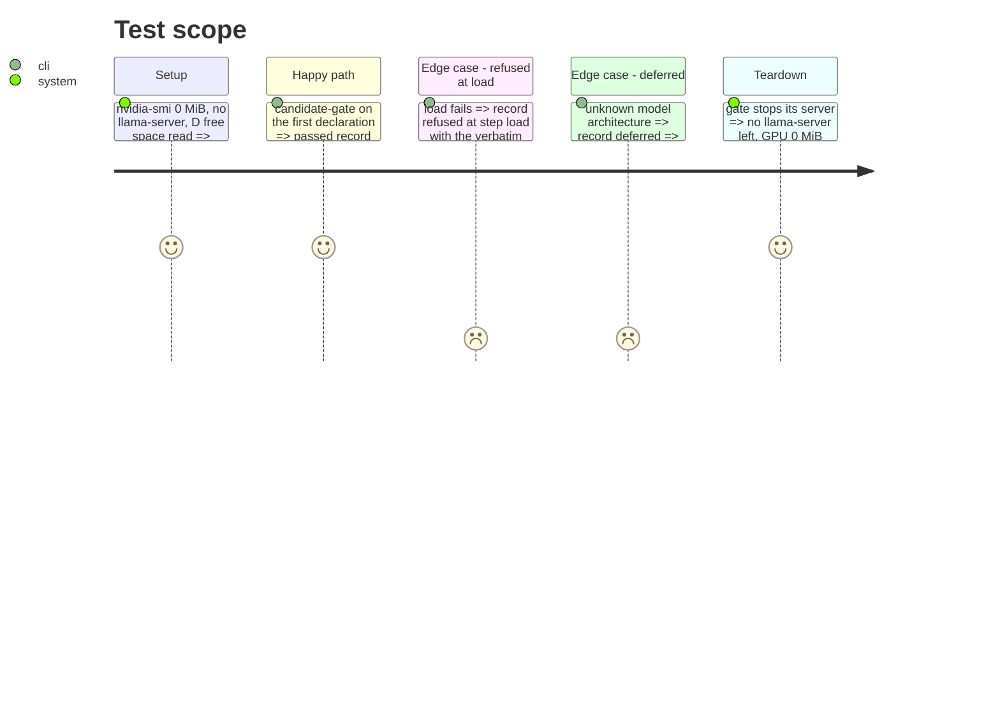

# Instruction: Candidate gate runs, in gate order

## Architecture projection

```txt
.
├── aidd_docs/roster/candidate-records.jsonl                       ✅
└── aidd_docs/tasks/2026_10/2026_10_04_half-billion-class/evidence/
    ├── candidates/granite-4.0-h-350m-q8.json                       ✅
    ├── candidates/granite-4.0-350m-q8.json                         ✅ (only if reached)
    ├── candidates/lfm2.5-350m-q8.json                              ✅ (only if reached)
    └── gate-<entry_id>.log                                         ✅
```

## User Journey



## Test Scope



## Tasks to do

### `1)` Declarations

> One declaration per pinned candidate, from the spike's table.

1. Write each declaration (spike pins, `Q8_0`, family `ibm`/`liquid`, `thinking_control: "none"`, language claim, `client_commercial_use` true for Apache-2.0, false for `lfm1.0`).

### `2)` Gate, one at a time

> Smallest download first; stop at the first candidate that later completes both suites.

1. Check GPU, port, D: free space before each run.
2. Run `wave-local-ai-v2-candidate-gate` with `LLAMA_SERVER_PATH` (b10537) and `SLM_MODELS_DIR=D:\ia\models`; log to `evidence/`.
3. On `deferred`: stop the story for the owner. On `refused`: record, move on.

## Test acceptance criteria

| Task | Acceptance criteria |
| ---- | ------------------- |
| 1 | Each declaration parses (`parse_candidate`) |
| 2 | One record per gate run in the candidate record; a pass's `observed` carries `llama_cpp_build`, `chat_template_hash`, `thinking` |
