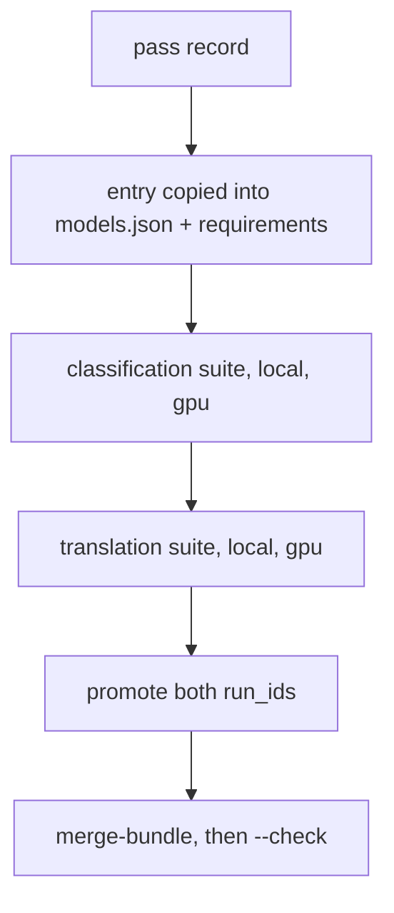
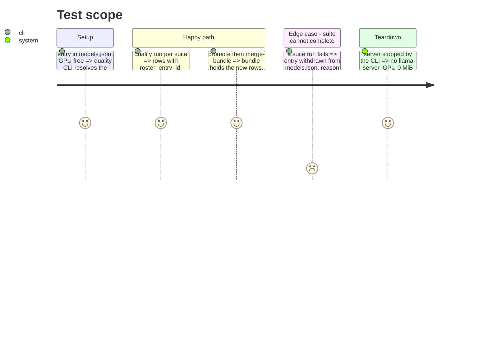

# Instruction: Roster entry, both suites, promote and merge

## Architecture projection

```txt
.
├── aidd_docs/roster/models.json                                   ✏️ entry from the pass record, roster_version 7
├── aidd_docs/results/machines/laptop-mobile-gpu/quality.jsonl     ✏️ promoted rows appended
├── aidd_docs/results/fiches/<hash>.json                           ✅ promoted fiche(s)
├── aidd_docs/results/quality-reference.jsonl                      ✏️ re-derived by merge-bundle
└── aidd_docs/tasks/2026_10/2026_10_04_half-billion-class/evidence/
    ├── quality.jsonl, fiches/                                     ✅ live stores
    └── suite-<suite>.log, promote.log, merge.log                  ✅
```

## User Journey



## Test Scope



## Tasks to do

### `1)` Entry

1. Copy the pass record's `entry` into `models.json`, add `requirements`, bump `roster_version` to 7.

### `2)` Suites

1. Run `wave-local-ai-v2-quality --suite classification-support-routing` then `--suite translation-business-short-form` with `MACHINE_ID=laptop-mobile-gpu`, `COMPUTE_MODE=gpu`, `QUALITY_PROVIDERS=local`, `ROSTER_ENTRY_ID=<entry>`, live stores and fiche registry in `evidence/`.

### `3)` Publish

1. `wave-local-ai-v2-promote --run-id <c> --run-id <t> --machine laptop-mobile-gpu` from the evidence stores.
2. `wave-local-ai-v2-merge-bundle`, then `--check`.

## Test acceptance criteria

| Task | Acceptance criteria |
| ---- | ------------------- |
| 1 | The roster loads with the new entry |
| 2 | 20 classification rows and 21 translation rows carry the entry id, a non-qwen family, `~0.5B`, `disabled` |
| 3 | `merge-bundle --check` exits 0; validate exits 0 on both reference files |
