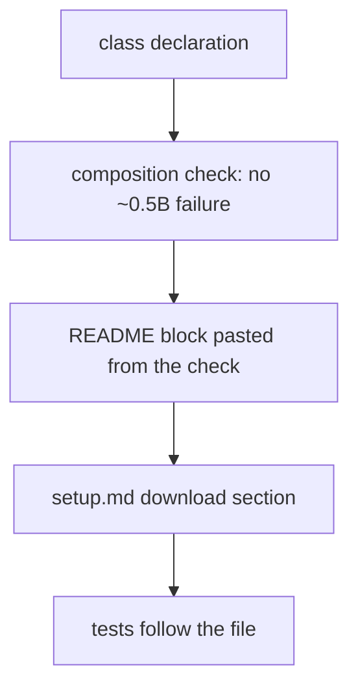
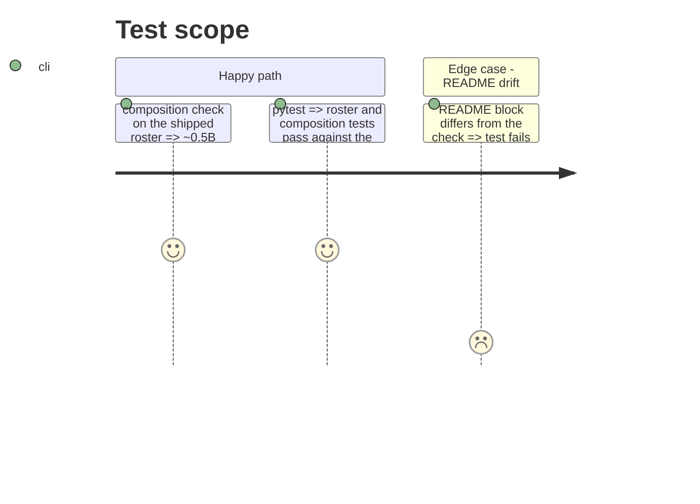

# Instruction: Class declaration, README, setup, tests

## Architecture projection

```txt
.
├── aidd_docs/roster/models.json            ✏️ size_classes["~0.5B"]: moe_sought true, absence reason
├── aidd_docs/results/README.md             ✏️ composition section regenerated + class findings
├── docs/setup.md                           ✏️ 1.2 requirements row, 3.3 download section
├── aidd_docs/memory/cli.md                 ✏️ roster table
├── tests/test_roster.py                    ✏️ new entry, version 7, declaration
└── tests/test_composition_check.py         ✏️ ~0.5B passes, five failures left
```

## User Journey



## Test Scope



## Tasks to do

### `1)` Declaration and docs

1. Declare `~0.5B`: `moe_sought: true`, `moe_entry: null`, reason citing the spike's search.
2. Regenerate the README block; add the class's findings (candidates, quant, licence basis, spike resolution lines, any claim contradiction).
3. Add `docs/setup.md` 3.3 download section and the 1.2 requirements row.

### `2)` Tests

1. `tests/test_roster.py`: entry identity, figures, family, version 7, declaration.
2. `tests/test_composition_check.py`: shipped-roster calibration follows the new composition.

## Test acceptance criteria

| Task | Acceptance criteria |
| ---- | ------------------- |
| 1 | The check prints no `size class ~0.5B` failure; the README block equals its output |
| 2 | `uv run pytest` passes at the coverage floor |
