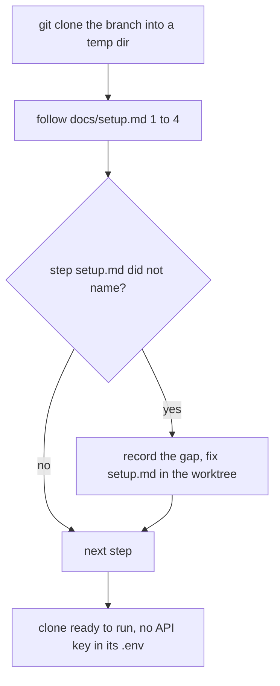
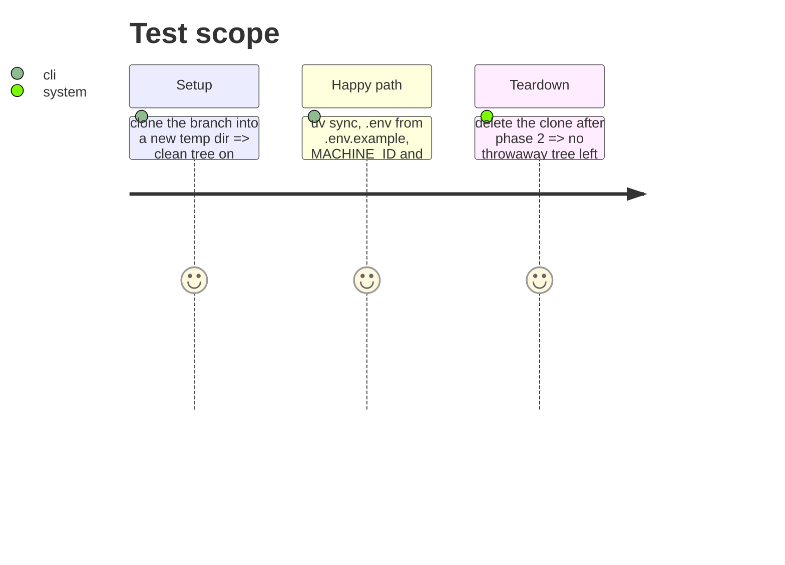

# Instruction: Fresh-clone setup walk

## Architecture projection

> Tree of the final files. ✅ create · ✏️ modify · ❌ delete

```txt
.
├── docs/setup.md  ✏️ every step the walk needed that it did not name
└── aidd_docs/tasks/2026_10/2026_10_04_laptop-republishes-bundle/evidence/
    └── setup-walk.md  ✅ the walk's log and the gaps found
```

## User Journey



## Test Scope



## Tasks to do

### `1)` Walk

> Reach a runnable clone with setup.md alone.

1. Clone, check out the branch, `uv sync`, `.env` from `.env.example` with `SLM_MODELS_DIR`, `LLAMA_SERVER_PATH`, `MACHINE_ID`, `COMPUTE_MODE`; no key.
2. Log each step and every gap in `evidence/setup-walk.md`.

### `2)` Fix setup.md

> One fix per gap, in the worktree.

## Test acceptance criteria

| Task | Acceptance criteria              |
| ---- | -------------------------------- |
| 1    | The clone's CLIs start a run under `laptop-mobile-gpu` and the mode's declared profile |
| 2    | Every gap logged has a matching sentence in `docs/setup.md` |
