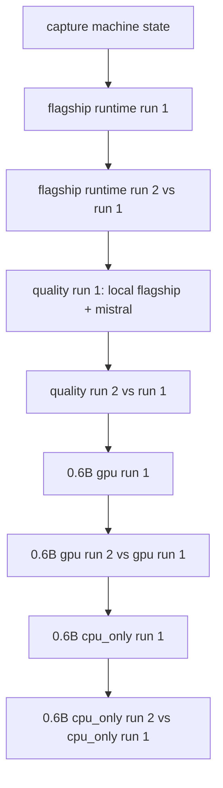
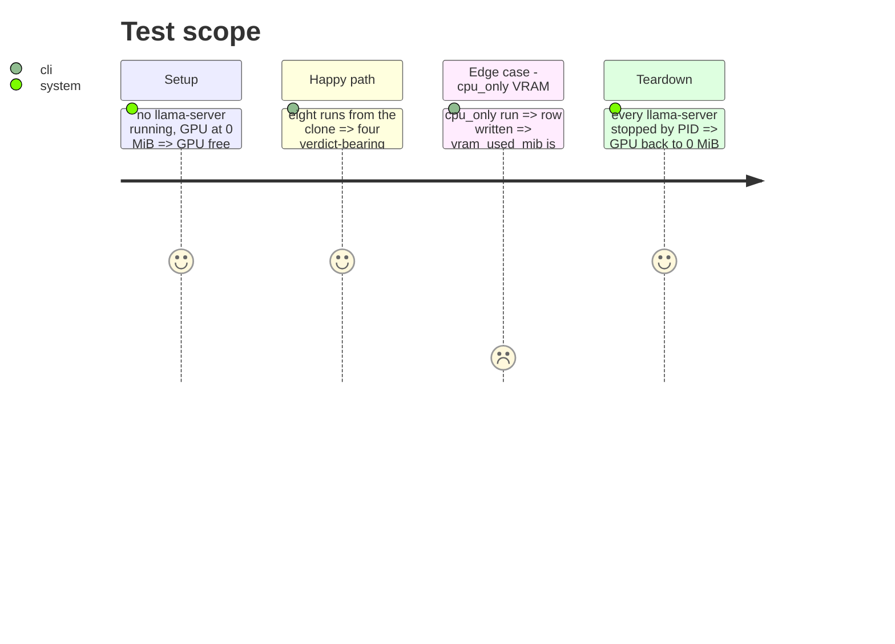

# Instruction: Bench session

## Architecture projection

> Tree of the final files. ✅ create · ✏️ modify · ❌ delete

```txt
aidd_docs/tasks/2026_10/2026_10_04_laptop-republishes-bundle/evidence/
├── machine-state.txt  ✅ power, nvidia-smi, top CPU processes, free RAM before the session
├── stores/runtime.jsonl, stores/quality.jsonl  ✅ the session's live stores
├── fiches/  ✅ the session's live fiche registry
└── refs/  ✅ the per-pair reference files
```

## User Journey



## Test Scope



## Tasks to do

### `1)` Capture the machine state

### `2)` Run the eight runs, one at a time, GPU free before each

1. Paid calls only in the two quality runs, key injected into that command only.

## Test acceptance criteria

| Task | Acceptance criteria              |
| ---- | -------------------------------- |
| 1    | `machine-state.txt` names power source, GPU memory, top CPU processes, free RAM |
| 2    | Each second run's verdict names its own first run's `run_id`; no gpu-vs-cpu_only throughput verdict exists; Mistral calls = 40 |
