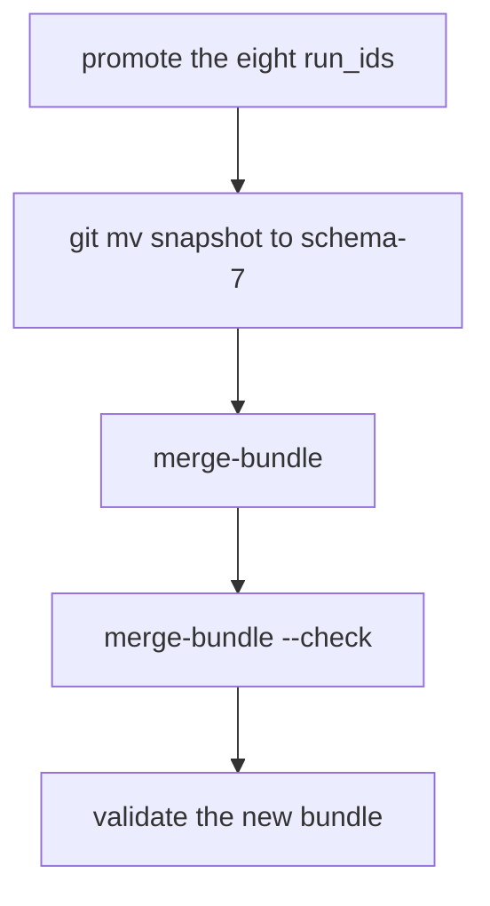
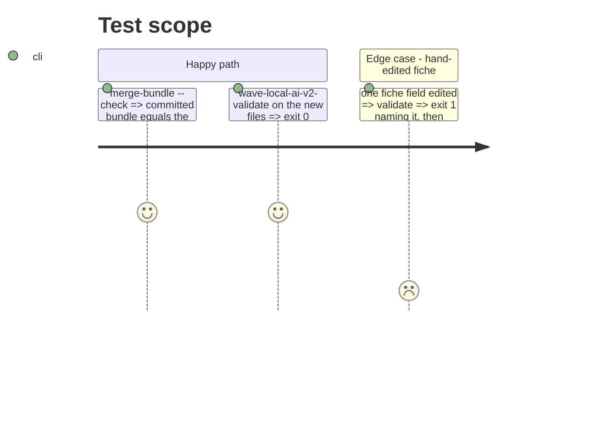

# Instruction: Promote, merge, supersede, validator proof

## Architecture projection

> Tree of the final files. ✅ create · ✏️ modify · ❌ delete

```txt
.
├── aidd_docs/results/
│   ├── machines/laptop-mobile-gpu/runtime.jsonl, quality.jsonl  ✅ promoted rows
│   ├── fiches/<hash>.json  ✅ promoted fiches
│   ├── runtime-reference.schema-7.jsonl, quality-reference.schema-7.jsonl  ✅ git mv of the snapshot
│   ├── runtime-reference.jsonl, quality-reference.jsonl, refusals-reference.jsonl  ✅ merged
├── src/wave_local_ai_v2/bundle_merge.py  ✏️ PRE_MERGE_SNAPSHOT removed
└── tests/test_bundle_merge.py, tests/test_reference_bundle.py  ✏️ pin tests removed, schema moved, superseded list
```

## User Journey



## Test Scope



## Tasks to do

### `1)` Promote, supersede, merge, check, validate

### `2)` Remove the pin and update its tests

## Test acceptance criteria

| Task | Acceptance criteria              |
| ---- | -------------------------------- |
| 1    | Bundle equals the merge; validator exits 0 on it, 1 on an edited fiche |
| 2    | No code or test names `PRE_MERGE_SNAPSHOT`; `tests/test_reference_bundle.py` green at the new schema |
