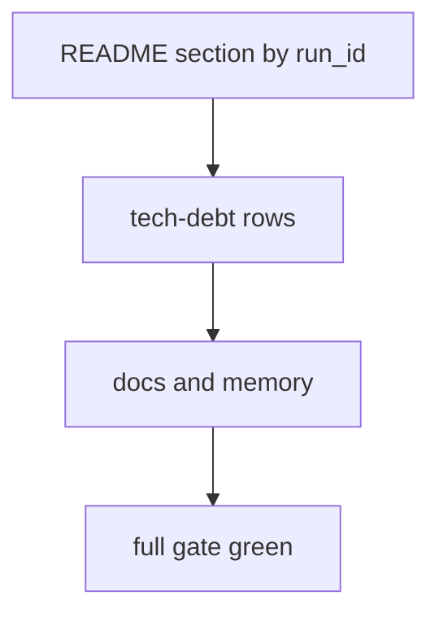
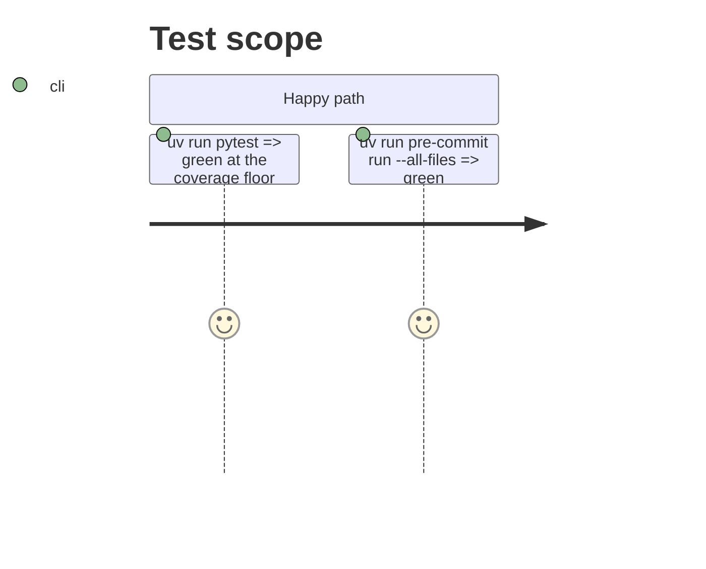

# Instruction: README, docs, tech debt, tests

## Architecture projection

> Tree of the final files. ✅ create · ✏️ modify · ❌ delete

```txt
.
├── aidd_docs/results/README.md  ✏️ dated regeneration section, schema-behind section retired
├── aidd_docs/backlog/tech-debt.md  ✏️ 2026-09-05 regeneration row closed, 2026-08-27 German row re-deferred by name
├── docs/setup.md  ✏️ section 6.1's "until the republication" paragraph
├── aidd_docs/memory/*.md  ✏️ the pin's mentions
└── tests/*  ✏️ tests that read the committed bundle as schema 7
```

## User Journey



## Test Scope



## Tasks to do

### `1)` README regeneration section and tech-debt rows

### `2)` Tests that pinned the schema-7 bundle follow it to its superseded file or to the new bundle

### `3)` Full gate and the key-leak count

## Test acceptance criteria

| Task | Acceptance criteria              |
| ---- | -------------------------------- |
| 1    | Rows cited by `run_id`, two verdicts per mode, the cpu_only/gpu ratio as an observation, setup gaps listed |
| 2    | Full suite green; no test asserts against schema 7 through the current bundle path |
| 3    | Key value found in 0 changed or created files |
