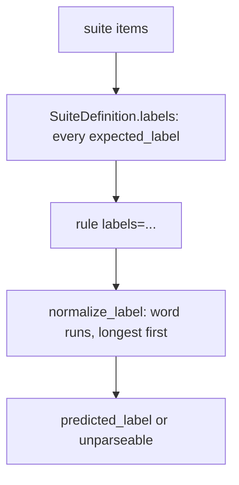
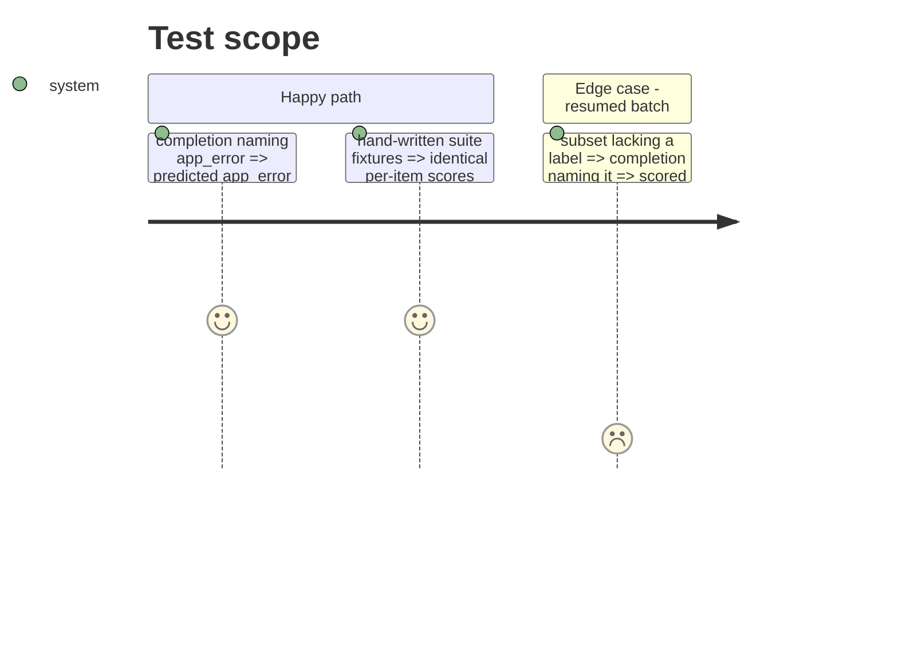

# Instruction: The scorer takes its label set from the suite and matches multi-word labels

## Architecture projection

> Tree of the final files. ✅ create · ✏️ modify · ❌ delete

```txt
.
├── src/wave_local_ai_v2/
│   ├── scoring.py               ✏️ normalize_label matches `_` labels; score_item takes `labels`
│   ├── scoring_rules.py         ✏️ every rule takes `labels`; exact_label_match passes it on
│   ├── suite_registry.py        ✏️ SuiteDefinition.labels; score_batch/score_items pass it
│   └── classification_suite.py  ✏️ docstring: LABELS is the hand-written suite's set, not the scorer's
└── tests/
    ├── test_scoring.py          ✏️ MInDS-14 intents parse; one-word sets unchanged
    ├── test_scoring_rules.py    ✏️ labels keyword
    ├── test_suite_registry.py   ✏️ resumed subset scores against the whole label set
    ├── test_judge.py            ✏️ categorical parse unchanged
    └── test_quality_cli.py      ✏️ fixture rule takes `labels`
```

## User Journey



## Test Scope



## Tasks to do

### `1)` Multi-word label matching

> The exact-label scorer reads its label set from the suite and parses labels holding an underscore.

1. Rewrite `normalize_label` over word runs; `score_item` takes `labels`.
2. Rules take `labels`; the registry passes `self.labels`.
3. Tests.

## Test acceptance criteria

| Task | Acceptance criteria              |
| ---- | -------------------------------- |
| 1 | Every MInDS-14 intent, written with `_`, a space or `-`, parses to itself; a one-word set parses as the old rule did; a resumed subset scores against the whole suite's labels; the judge's categorical parse is unchanged |
