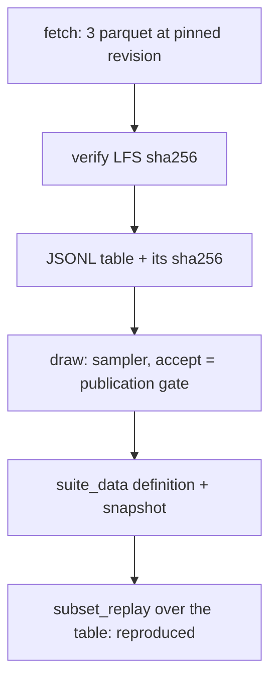
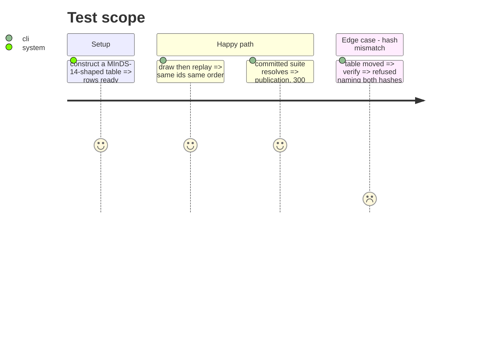

# Instruction: The loader, the drawn suite, its snapshot, the export columns and the dependency group

## Architecture projection

> Tree of the final files. ✅ create · ✏️ modify · ❌ delete

```txt
.
├── pyproject.toml, uv.lock                                    ✏️ `loaders` group, pyarrow pinned
├── scripts/minds14_suite.py                                   ✅ fetch / draw / verify
├── src/wave_local_ai_v2/suite_data/classification-banking-intents-minds14.json  ✅ 300 drawn items
├── src/wave_local_ai_v2/bundle_export.py                      ✏️ SUITE_DEFINITION_FIELDS
├── aidd_docs/results/suite-definitions/classification-banking-intents-minds14@1.json  ✅ snapshot
└── tests/
    ├── test_minds14_suite.py         ✅ loader rows, table hash, licence-file check, draw + replay over a constructed table
    ├── test_suite_registry.py        ✏️ the committed suite certifies at publication with its rule and items
    ├── test_audit_dependencies.py    ✏️ export takes every group; the loaders group is declared
    └── test_recompute_from_export.py ✏️ export + recompute over a bundle with a publication batch
```

## User Journey



## Test Scope



## Tasks to do

### `1)` Loader and suite

> MInDS-14 at its pinned revision becomes a JSONL table, a recorded draw and a certified suite.

1. Script with fetch, draw, verify; pure helpers testable without pyarrow.
2. Fetch live, draw, write the definition and its snapshot.
3. Export field docs; dependency group; tests.

## Test acceptance criteria

| Task | Acceptance criteria              |
| ---- | -------------------------------- |
| 1 | The suite certifies at publication with 300 items, 100 per language, its rule and the table's SHA-256 recorded; a constructed table replays to its recorded ids; the export and recompute run clean over a bundle holding a publication batch |
