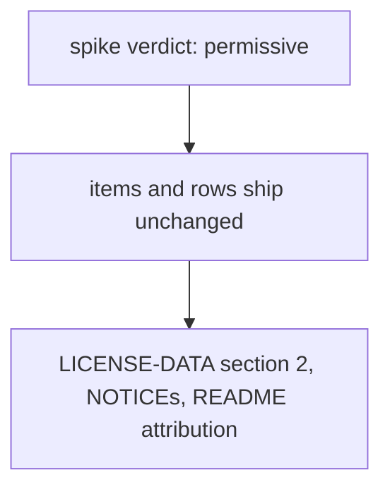
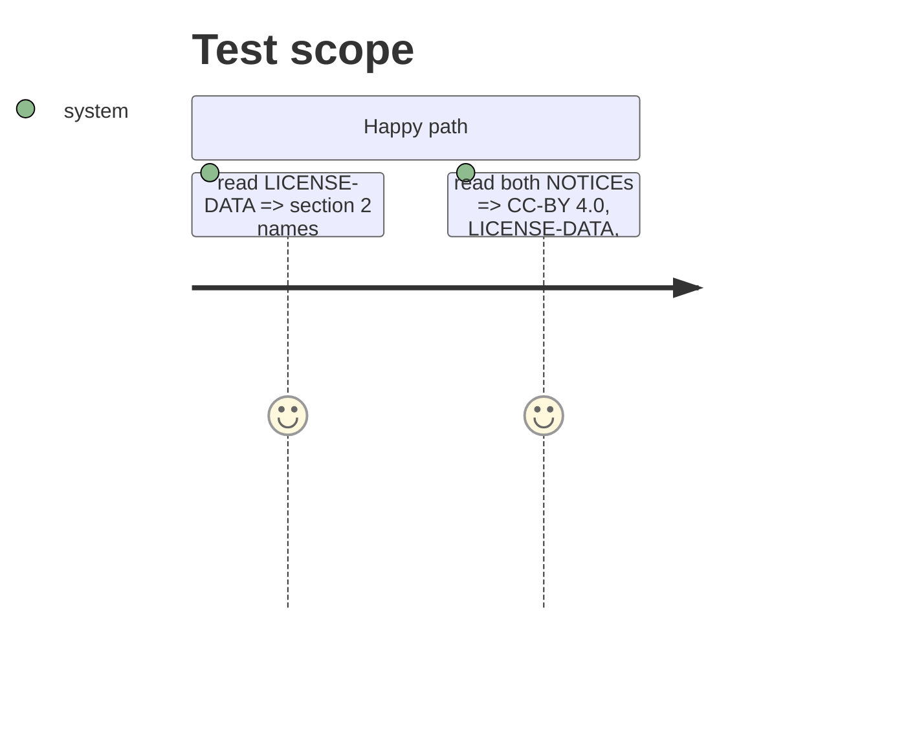

# Instruction: Licence, NOTICE, coverage record and README statement of the rung

## Architecture projection

> Tree of the final files. ✅ create · ✏️ modify · ❌ delete

```txt
.
├── LICENSE-DATA                                   ✏️ 1.1 hand-written only; section 2 names MInDS-14
├── src/wave_local_ai_v2/suite_data/NOTICE.md      ✏️ drawn items carry their own licence
├── aidd_docs/results/suite-definitions/NOTICE.md  ✏️ same; "No item here is drawn today" dropped
├── src/wave_local_ai_v2/use_case_coverage.json    ✏️ classification gains the suite id
├── aidd_docs/results/README.md                    ✏️ rung and attribution statement
└── tests/test_data_licence.py                     ✏️ section 2 names the drawn source
```

## User Journey



## Test Scope



## Tasks to do

### `1)` Licence texts and coverage

> The licence files stop claiming a drawn item and name the drawn source.

1. Edit the three licence files, the coverage record and the README.

## Test acceptance criteria

| Task | Acceptance criteria              |
| ---- | -------------------------------- |
| 1 | No file claims a drawn item under CC-BY 4.0; section 2 names MInDS-14, its revision, CC BY 4.0, the permissive rung and the attribution; the coverage record lists both classification suites |
