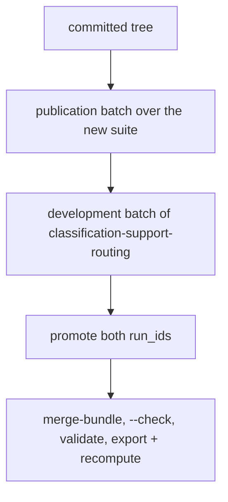
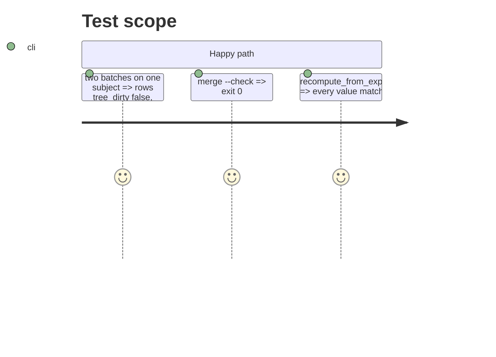

# Instruction: Stage B: the two published batches, promotion, merge and evidence

## Architecture projection

> Tree of the final files. ✅ create · ✏️ modify · ❌ delete

```txt
.
├── aidd_docs/results/machines/laptop-mobile-gpu/quality.jsonl  ✏️ two batches appended
├── aidd_docs/results/quality-reference.jsonl                  ✏️ merged
├── aidd_docs/results/fiches/                                  ✏️ a fiche if new
├── aidd_docs/results/README.md                                ✏️ the run section
└── tests/test_reference_bundle.py                             ✏️ the pair shares roster entry, fiche and engine build
```

## User Journey



## Test Scope



## Tasks to do

### `1)` Run and publish

> Both sizes carry `score_interval` on one subject from one committed tree.

1. Two batches, one session, one subject; promote; merge; check; README.

## Test acceptance criteria

| Task | Acceptance criteria              |
| ---- | -------------------------------- |
| 1 | Both batches are in the bundle with `score_interval`, the same `roster_entry_id`, `fiche_hash` and `engine_build`, and the export and recompute run clean |
