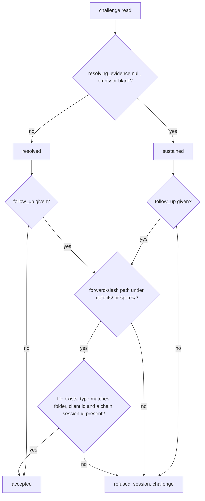

# Instruction: The derivation, the follow-up refusals and the procedure step

## Architecture projection

```txt
.
├── src/wave_local_ai_v2/client_sessions.py   ✏️ is_sustained, frontmatter_type, repo_item_reader, follow-up refusals, sustained count in the read-back
├── tests/test_client_sessions.py             ✏️ derivation, every refusal, chain, sharing, closed items, rename after commit
├── docs/client-session-record.md             ✏️ step 4 "File a follow-up item", follow-up refusals in the check step, commit record and item together
└── aidd_docs/memory/cli.md                   ✏️ the command's new refusals and read-back count
```

## User Journey



## Test Scope

`tests/test_client_sessions.py`, section "sustained challenges and their follow-up items": null / empty / whitespace read as sustained, named evidence as resolved; one planted record per refusal (absent, empty, null, outside the folders, the bare folder, missing file, mistyped item each way, no session id, no client id, no frontmatter, `..`, POSIX and drive absolute paths, backslash), each naming the session and the challenge; a defect and a spike both pass; an item naming only the replaced record serves the correction; an unrelated session id is refused; two challenges share one item; a resolved challenge links an item and stays resolved (and a missing link is refused); `cancelled` and `done` items leave the challenge sustained; the frontmatter reader; a correction loop through a duplicate id terminates; a cited item renamed after the record is written fails `check_file`, the function the committed-record test runs.

## Validation

`uv run pytest`, `uv run pre-commit run --all-files`, the secrets scan on the changed files, the dependency audit and the two store validations.
