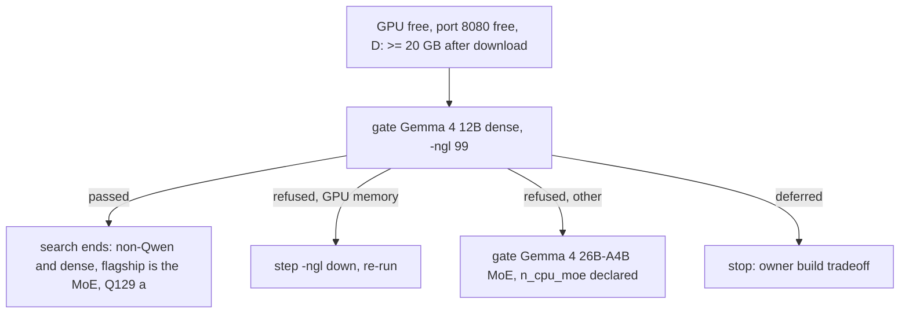

# Instruction: Candidate gate runs, in gate order

## Architecture projection

```txt
.
├── aidd_docs/roster/candidate-records.jsonl                ✏️ one record per gate run
└── aidd_docs/tasks/2026_10/2026_10_04_top-class/evidence/
    ├── candidates/<entry_id>.json                           ✅ one declaration per pinned candidate
    ├── gate-<entry_id>.log                                  ✅
    └── gate-<entry_id>.vram.csv                             ✅ dedicated GPU memory every 2 s
```

## User Journey



## Tasks to do

### `1)` Declarations

1. One declaration per pinned candidate (spike pins, `IQ4_XS` for the 12B as the nearest to `UD-IQ4_XS`, `UD-IQ4_XS` for the 26B-A4B, `google`, the Gemma 4 thinking switch, the card's language statement naming no language).

### `2)` Gate, one at a time

1. GPU, port, D: free space before each run (stop under 20 GB left); sample dedicated GPU memory during the run.
2. `wave-local-ai-v2-candidate-gate` with `LLAMA_SERVER_PATH` (b10537) and `SLM_MODELS_DIR=D:\ia\models`; log to `evidence/`.
3. Stop once the 12B passed (Q129 (a)), subject to both suites in stage B.

## Test acceptance criteria

| Task | Acceptance criteria |
| ---- | ------------------- |
| 1 | Each declaration parses (`parse_candidate`) |
| 2 | One record per gate run; a pass's `observed` carries `llama_cpp_build`, `chat_template_hash`, `thinking` |
