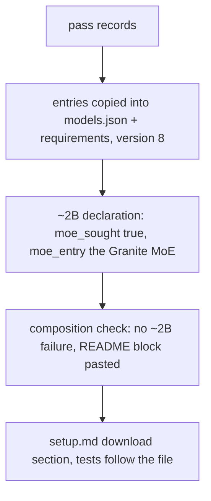

# Instruction: Roster entries, class declaration, docs, tests (stage A)

## Architecture projection

```txt
.
├── aidd_docs/roster/models.json            ✏️ two entries from the pass records, roster_version 8, ~2B declaration names its MoE
├── aidd_docs/results/README.md             ✏️ composition block regenerated + the class's section
├── docs/setup.md                           ✏️ 1.2 requirements rows, 3.4 download section
├── aidd_docs/memory/cli.md                 ✏️ roster table
├── tests/test_roster.py                    ✏️ new entries, version 8, ~2B declaration
├── tests/test_composition_check.py         ✏️ ~2B passes, three failures left
└── tests/test_playground.py                ✏️ options list the new entries
```

## User Journey



## Tasks to do

1. Copy each pass record's `entry` into `models.json` with `requirements` (lower bounds, the weights' size); bump to 8; declare `~2B`.
2. Regenerate the README block; add the class section (candidates, quant, licence basis, MoE, spike lines).
3. `docs/setup.md` 1.2 rows and 3.4; `cli.md` table; tests.

## Test acceptance criteria

| Task | Acceptance criteria |
| ---- | ------------------- |
| 1 | The roster loads; the composition check prints no `size class ~2B` failure |
| 2 | The README block equals the check's output |
| 3 | `uv run pytest` passes at the coverage floor |
